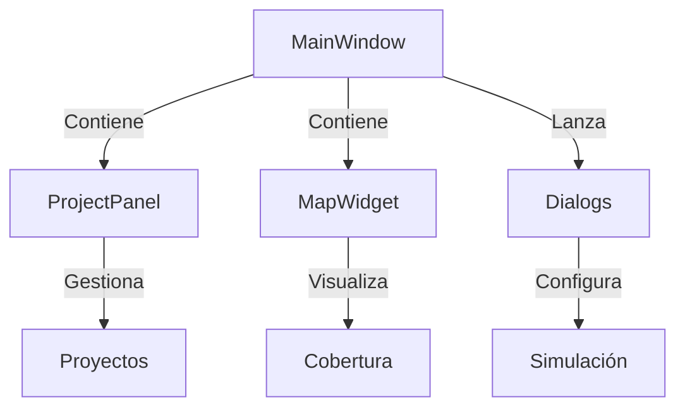

# Arquitectura de la Interfaz Gráfica (GUI)

**Versión:** 2026-05-08

## 1. Introducción
La interfaz gráfica está desarrollada en PyQt6 y organiza la interacción del usuario con el sistema de simulación. Esta sección describe la estructura, paneles, flujos y comunicación con el núcleo de cómputo.

## 2. Estructura General
- **main_window.py**: Ventana principal, orquesta la aplicación.
- **splash_screen.py**: Pantalla de carga inicial.
- **panels/project_panel.py**: Panel de gestión de proyectos.
- **widgets/**: Componentes reutilizables.
- **dialogs/**: Diálogos para simulación, antenas, configuración, etc.

## 3. Diagrama de Cajas (Resumen)



## 4. Flujos Principales
- **Carga de proyecto:** ProjectPanel → carga archivos .rfproj.
- **Configuración de simulación:** Diálogos especializados.
- **Ejecución:** MainWindow orquesta el pipeline y muestra resultados.
- **Visualización:** MapWidget (basado en QWebEngine/Leaflet) muestra mapas y heatmaps.

## 5. Entradas y Salidas
- **Entradas:** Archivos de proyecto, parámetros de simulación, selección de terreno/modelo.
- **Salidas:** Mapas de cobertura, reportes, archivos exportados.

## 6. Comunicación con el Núcleo
- Señales y slots de PyQt6.
- Llamadas a workers para simulación asíncrona.
- Recepción de resultados y actualización de UI.

## 7. Ejemplo de Código
```python
# Lanzar simulación desde la GUI
self.simulation_worker = SimulationWorker(params)
self.simulation_worker.finished.connect(self.on_simulation_finished)
self.simulation_worker.start()
```

## 8. Observaciones
- Modularidad: cada panel/diálogo es una clase independiente.
- Extensible: fácil agregar nuevos paneles o widgets.

---

**Ver también:** [02_CORE_COMPUTE.md](02_CORE_COMPUTE.md) para detalles del núcleo de cómputo.
