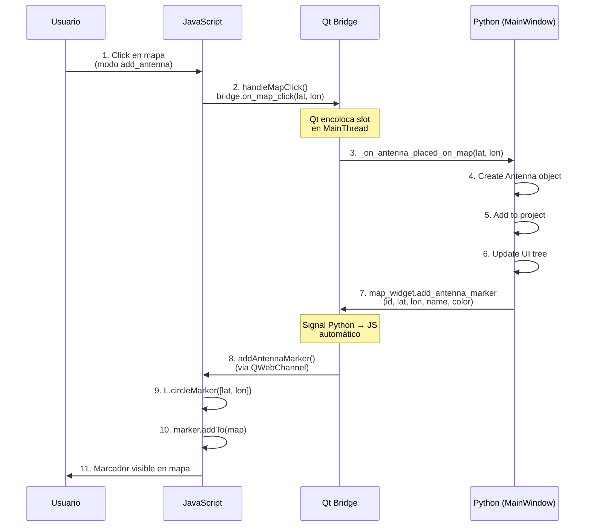

# Interfaz Gráfica: GUI con PyQt6, QWebEngineView y Leaflet

**Versión:** 2026-05-08

## 1. Propósito

La interfaz gráfica es el punto de interacción entre el usuario y el motor de simulación. Utiliza PyQt6 para UI nativa, QWebEngineView + Leaflet.js para visualización cartográfica, y Qt Bridge para comunicación bidireccional Python↔JavaScript.

## 2. Stack Tecnológico

```
┌──────────────────────────────────┐
│ Aplicación Python (PyQt6)        │
├──────────────────────────────────┤
│ MainWindow                       │
│  ├─ Project Panel (árbol)        │
│  ├─ Dialogs (simulación, etc.)   │
│  └─ MapWidget ─────┐             │
│                    │             │
├────────────────────▼─────────────┤
│ QWebEngineView (Chromium)        │
│ ┌──────────────────────────────┐ │
│ │ HTML/CSS/JavaScript          │ │
│ │  ├─ Leaflet.js               │ │
│ │  ├─ OSM/Satellite layers     │ │
│ │  ├─ Markers (antenas)        │ │
│ │  └─ ImageOverlay (cobertura) │ │
│ └──────────────────────────────┘ │
│ ┌──────────────────────────────┐ │
│ │ Qt WebChannel (puente JSON)  │ │
│ │ signal↔slot thread-safe      │ │
│ └──────────────────────────────┘ │
└──────────────────────────────────┘
```

## 3. Arquitectura: MapWidget y Puente Python↔JavaScript

### 3.1 Clase MapBridge (Python → JavaScript)

**Ubicación**: `src/ui/widgets/map_widget.py`, líneas 13-80

```python
from PyQt6.QtCore import QObject, pyqtSignal, pyqtSlot

class MapBridge(QObject):
    """
    Puente bidireccional entre Python y JavaScript.
    
    Proporciona:
    - Signals (Python → JavaScript): emisor de comandos
    - Slots (JavaScript → Python): receptor de eventos
    """
    
    # ────────────────────────────────────────────────────
    # SIGNALS: Python emite, JavaScript recibe
    # ────────────────────────────────────────────────────
    
    # Agregar marcador de antena en mapa
    add_antenna_marker = pyqtSignal(str, float, float, str, str)
    # Parámetros: antenna_id, lat, lon, name, color
    # Ej: bridge.add_antenna_marker.emit('ant-001', -2.9001, -79.0059, 'Sitio Principal', '#FF0000')
    
    # Eliminar marcador de antena
    remove_antenna_marker = pyqtSignal(str)
    # Parámetro: antenna_id
    
    # Actualizar marcador (mover, cambiar color)
    update_antenna_marker = pyqtSignal(str, float, float, float, str)
    # Parámetros: antenna_id, lat, lon, azimuth_degrees, color
    
    # Agregar capa de cobertura (heatmap)
    add_coverage_layer = pyqtSignal(str, str, float, float, float, float)
    # Parámetros: antenna_id, image_data_url (base64), lat_min, lon_min, lat_max, lon_max
    # image_data_url: "data:image/png;base64,iVBORw0KGgo..."
    
    # Eliminar capa de cobertura
    remove_coverage_layer = pyqtSignal(str)
    # Parámetro: antenna_id
    
    # Cambiar modo del mapa
    set_map_mode = pyqtSignal(str)
    # Parámetro: 'pan' (normal) | 'add_antenna' (agregar antena) | 'move_antenna' (mover)
    
    # Centrar mapa
    center_map = pyqtSignal(float, float, int)
    # Parámetros: lat, lon, zoom_level
    
    # ────────────────────────────────────────────────────
    # SLOTS: JavaScript emite, Python recibe
    # ────────────────────────────────────────────────────
    
    # Eventos de usuario en mapa
    antenna_clicked_on_map = pyqtSignal(float, float)      # lat, lon (click para agregar antena)
    antenna_marker_clicked = pyqtSignal(str)               # antenna_id (click en marcador)
    antenna_marker_moved = pyqtSignal(str, float, float)  # antenna_id, lat, lon (drag antena)
    antenna_marker_selected = pyqtSignal(str)             # antenna_id (seleccionar)
    map_clicked = pyqtSignal(float, float)                # lat, lon (click general)
    map_center_response = pyqtSignal(float, float, int)   # lat, lon, zoom (respuesta de posición)
    
    # ────────────────────────────────────────────────────
    # SLOTS PYTHON (receptores de JavaScript)
    # ────────────────────────────────────────────────────
    
    @pyqtSlot(float, float)
    def on_map_click(self, lat: float, lon: float):
        """Callback desde JavaScript: usuario hizo click en mapa"""
        self.logger.debug(f"Map clicked at ({lat}, {lon})")
        self.map_clicked.emit(lat, lon)
    
    @pyqtSlot(str, float, float)
    def on_antenna_marker_moved(self, antenna_id: str, lat: float, lon: float):
        """Callback desde JavaScript: usuario arrastró marcador de antena"""
        self.logger.debug(f"Antenna {antenna_id} moved to ({lat}, {lon})")
        self.antenna_marker_moved.emit(antenna_id, lat, lon)
    
    @pyqtSlot(str)
    def on_antenna_marker_clicked(self, antenna_id: str):
        """Callback desde JavaScript: usuario hizo click en marcador"""
        self.logger.debug(f"Antenna marker {antenna_id} clicked")
        self.antenna_marker_clicked.emit(antenna_id)
    
    @pyqtSlot(float, float, int)
    def on_map_center(self, lat: float, lon: float, zoom: int):
        """Callback desde JavaScript: solicitud de información de centro del mapa"""
        self.map_center_response.emit(lat, lon, zoom)
```

### 3.2 HTML Base del Mapa

**Ubicación**: `src/ui/widgets/map_widget.py`, método `_load_map_html()`

```html
<!DOCTYPE html>
<html>
<head>
    <meta charset="utf-8">
    <meta name="viewport" content="width=device-width, initial-scale=1.0">
    <title>RF Coverage Map</title>
    
    <!-- Leaflet CSS -->
    <link rel="stylesheet" href="https://unpkg.com/leaflet@1.9.4/dist/leaflet.css" />
    <link rel="stylesheet" href="https://unpkg.com/leaflet-draw@1.0.4/dist/leaflet.draw.css" />
    
    <!-- Qt WebChannel para puente Python↔JS -->
    <script src="qrc:///qtwebchannel/qwebchannel.js"></script>
    
    <style>
        html, body { margin: 0; padding: 0; width: 100%; height: 100%; }
        #map { width: 100%; height: 100%; }
        .antenna-popup { font-family: Arial, sans-serif; font-size: 12px; }
        .coverage-layer { opacity: 0.6; }
    </style>
</head>
<body>
    <div id="map"></div>
    
    <script src="https://unpkg.com/leaflet@1.9.4/dist/leaflet.js"></script>
    <script src="https://unpkg.com/leaflet-draw@1.0.4/dist/leaflet.draw.js"></script>
    
    <script>
        // ─────────────────────────────────────
        // VARIABLES GLOBALES
        // ─────────────────────────────────────
        let map;
        let bridge;
        let antennaMarkers = {};           // antenna_id → L.marker
        let coverageLayers = {};           // antenna_id → L.imageOverlay
        let currentMode = 'pan';           // 'pan', 'add_antenna', 'move_antenna'
        
        // ─────────────────────────────────────
        // INICIALIZACIÓN DEL MAPA
        // ─────────────────────────────────────
        function initMap() {
            // Crear mapa centrado en Cuenca, Ecuador
            map = L.map('map').setView([-2.9001, -79.0059], 13);
            
            // Capa base: OpenStreetMap
            const osmLayer = L.tileLayer(
                'https://{s}.tile.openstreetmap.org/{z}/{x}/{y}.png',
                {
                    attribution: '© OpenStreetMap contributors',
                    maxZoom: 19,
                    minZoom: 5
                }
            );
            osmLayer.addTo(map);
            
            // Capa alternativa: Satélite (ESRI)
            const satelliteLayer = L.tileLayer(
                'https://server.arcgisonline.com/ArcGIS/rest/services/World_Imagery/MapServer/tile/{z}/{y}/{x}',
                {
                    attribution: '© ESRI',
                    maxZoom: 19
                }
            );
            
            // Control de capas
            const layerControl = L.control.layers(
                {
                    'OpenStreetMap': osmLayer,
                    'Satellite': satelliteLayer
                },
                null,
                { position: 'topright' }
            );
            layerControl.addTo(map);
            
            // Controles estándar
            L.control.scale().addTo(map);
            
            // Event listeners
            map.on('click', handleMapClick);
            map.on('moveend', handleMapMove);
        }
        
        // ─────────────────────────────────────
        // EVENT HANDLERS
        // ─────────────────────────────────────
        
        function handleMapClick(e) {
            const lat = e.latlng.lat;
            const lon = e.latlng.lng;
            
            if (currentMode === 'add_antenna') {
                // Usuario quiere agregar antena
                bridge.on_map_click(lat, lon);
            } else if (currentMode === 'pan') {
                // Modo normal: solo informar
                bridge.on_map_click(lat, lon);
            }
        }
        
        function handleMapMove() {
            const center = map.getCenter();
            const zoom = map.getZoom();
            bridge.on_map_center(center.lat, center.lng, zoom);
        }
        
        // ─────────────────────────────────────
        // FUNCIONES DE ANTENAS
        // ─────────────────────────────────────
        
        function addAntennaMarker(antenna_id, lat, lon, name, color) {
            if (antennaMarkers[antenna_id]) {
                removeAntennaMarker(antenna_id);
            }
            
            // Crear marcador personalizado
            const marker = L.circleMarker([lat, lon], {
                radius: 8,
                fillColor: color,
                color: '#000',
                weight: 2,
                opacity: 1,
                fillOpacity: 0.8,
                draggable: true
            });
            
            // Popup
            const popupContent = `
                <div class="antenna-popup">
                    <b>${name}</b><br/>
                    Lat: ${lat.toFixed(4)}<br/>
                    Lon: ${lon.toFixed(4)}<br/>
                    ID: ${antenna_id}
                </div>
            `;
            marker.bindPopup(popupContent);
            
            // Event listeners
            marker.on('click', function() {
                bridge.on_antenna_marker_clicked(antenna_id);
            });
            
            marker.on('dragend', function(e) {
                const new_lat = e.target.getLatLng().lat;
                const new_lon = e.target.getLatLng().lng;
                bridge.on_antenna_marker_moved(antenna_id, new_lat, new_lon);
            });
            
            marker.addTo(map);
            antennaMarkers[antenna_id] = marker;
            
            console.log(`Antenna marker added: ${antenna_id}`);
        }
        
        function removeAntennaMarker(antenna_id) {
            if (antennaMarkers[antenna_id]) {
                map.removeLayer(antennaMarkers[antenna_id]);
                delete antennaMarkers[antenna_id];
                console.log(`Antenna marker removed: ${antenna_id}`);
            }
        }
        
        // ─────────────────────────────────────
        // FUNCIONES DE COBERTURA
        // ─────────────────────────────────────
        
        function addCoverageLayer(antenna_id, image_data_url, lat_min, lon_min, lat_max, lon_max) {
            if (coverageLayers[antenna_id]) {
                removeCoverageLayer(antenna_id);
            }
            
            const bounds = [[lat_min, lon_min], [lat_max, lon_max]];
            
            const overlay = L.imageOverlay(
                image_data_url,
                bounds,
                {
                    opacity: 0.6,
                    className: 'coverage-layer',
                    zIndex: 100
                }
            );
            
            overlay.addTo(map);
            coverageLayers[antenna_id] = overlay;
            
            console.log(`Coverage layer added: ${antenna_id}`);
        }
        
        function removeCoverageLayer(antenna_id) {
            if (coverageLayers[antenna_id]) {
                map.removeLayer(coverageLayers[antenna_id]);
                delete coverageLayers[antenna_id];
                console.log(`Coverage layer removed: ${antenna_id}`);
            }
        }
        
        // ─────────────────────────────────────
        // INICIALIZAR PUENTE (Qt WebChannel)
        // ─────────────────────────────────────
        
        new QWebChannel(qt.webChannelTransport, function(channel) {
            bridge = channel.objects.bridge;
            
            // Conectar signals Python → JavaScript
            bridge.add_antenna_marker.connect(function(id, lat, lon, name, color) {
                addAntennaMarker(id, lat, lon, name, color);
            });
            
            bridge.remove_antenna_marker.connect(function(id) {
                removeAntennaMarker(id);
            });
            
            bridge.add_coverage_layer.connect(function(id, img, lat_min, lon_min, lat_max, lon_max) {
                addCoverageLayer(id, img, lat_min, lon_min, lat_max, lon_max);
            });
            
            bridge.remove_coverage_layer.connect(function(id) {
                removeCoverageLayer(id);
            });
            
            bridge.set_map_mode.connect(function(mode) {
                currentMode = mode;
                console.log(`Map mode changed to: ${mode}`);
            });
            
            bridge.center_map.connect(function(lat, lon, zoom) {
                map.setView([lat, lon], zoom);
            });
            
            // Inicializar mapa
            initMap();
            console.log('Map initialized');
        });
    </script>
</body>
</html>
```

## 4. Flujo de Eventos Completo: Usuario Coloca Antena

### 4.1 Diagrama de Secuencia



### 4.2 Código Python: Manejo de Click

**Ubicación**: `src/ui/main_window.py`, líneas 400-450

```python
class MainWindow(QMainWindow):
    def __init__(self):
        super().__init__()
        # ... setup UI ...
        
        # Conectar signals del mapa
        self.map_widget.bridge.map_clicked.connect(
            self._on_map_clicked
        )
        self.map_widget.bridge.antenna_marker_moved.connect(
            self._on_antenna_moved
        )
    
    @pyqtSlot(float, float)
    def _on_map_clicked(self, lat: float, lon: float):
        """Usuario hizo click en mapa"""
        
        if self.current_mode == 'add_antenna':
            # Crear nueva antena
            antenna_id = f"ant-{len(self.project.antennas) + 1:03d}"
            
            antenna = Antenna(
                id=antenna_id,
                name=f"Antena {antenna_id}",
                latitude=lat,
                longitude=lon,
                height_agl=15.0,
                frequency_mhz=900,
                tx_power_dbm=40,
                azimuth_degrees=0,
            )
            
            # Agregar al proyecto
            self.project.antennas.append(antenna)
            
            # Actualizar árbol de proyecto
            self._update_project_tree()
            
            # Agregar marcador en mapa
            self.map_widget.bridge.add_antenna_marker.emit(
                antenna_id,
                lat,
                lon,
                antenna.name,
                '#FF0000'  # rojo
            )
            
            # Salir de modo add_antenna
            self.current_mode = 'pan'
            self.map_widget.bridge.set_map_mode.emit('pan')
            
            self.logger.info(f"Antenna {antenna_id} placed at ({lat}, {lon})")
```

## 5. Conexión con Motor de Cálculo

### 5.1 Mostrar Resultados de Simulación

**Ubicación**: `src/ui/main_window.py`, líneas 550-620

```python
    @pyqtSlot(dict)
    def _on_simulation_finished(self, results):
        """
        Simulación completada: mostrar resultados en mapa
        
        results = {
            'individual': {
                'ant-001': {..., 'image_url': '...', 'bounds': [...]}
            },
            'aggregated': {..., 'image_url': '...', 'bounds': [...]}
        }
        """
        
        self.logger.info("Simulation completed, updating visualization")
        
        # Mostrar cobertura individual de cada antena
        for ant_id, coverage_data in results['individual'].items():
            image_url = coverage_data['image_url']     # data:image/png;base64,...
            bounds = coverage_data['bounds']            # [[lat_min, lon_min], [lat_max, lon_max]]
            
            self.map_widget.bridge.add_coverage_layer.emit(
                antenna_id=ant_id,
                image_data_url=image_url,
                lat_min=bounds[0][0],
                lon_min=bounds[0][1],
                lat_max=bounds[1][0],
                lon_max=bounds[1][1]
            )
        
        # Mostrar cobertura agregada
        if 'aggregated' in results:
            agg = results['aggregated']
            agg_image = agg['image_url']
            agg_bounds = agg['bounds']
            
            self.map_widget.bridge.add_coverage_layer.emit(
                antenna_id='aggregated',
                image_data_url=agg_image,
                lat_min=agg_bounds[0][0],
                lon_min=agg_bounds[0][1],
                lat_max=agg_bounds[1][0],
                lon_max=agg_bounds[1][1]
            )
        
        # Actualizar información en UI
        if 'metadata' in results:
            metadata = results['metadata']
            self.status_label.setText(
                f"Simulación: {metadata['num_antennas']} antenas, "
                f"{metadata['gpu_device']}, "
                f"Tiempo: {metadata['total_execution_time_seconds']:.2f}s"
            )
```

### 5.2 Cajas de Entradas y Salidas

```
┌─────────────────────────────────────────────┐
│ SimulationWorker.finished(dict results)     │
├─────────────────────────────────────────────┤
│ {                                           │
│   'individual': {                           │
│     'ant-001': {'image_url', 'bounds', ...} │
│   },                                        │
│   'aggregated': {'image_url', 'bounds', ...}│
│ }                                           │
└─────────────────────────────────────────────┘
             │
             ↓ Signal Python
        ┌────────────────────┐
        │ MainWindow._on_    │
        │ simulation_finished│
        └────────────────────┘
             │
             ↓
        ┌────────────────────┐
        │ map_widget.bridge. │
        │ add_coverage_layer │
        │ .emit()            │
        └────────────────────┘
             │
             ↓ Qt Bridge JSON
        ┌────────────────────────────────┐
        │ JavaScript                     │
        │ addCoverageLayer(              │
        │   antenna_id,                  │
        │   image_data_url (base64),     │
        │   bounds                       │
        │ )                              │
        └────────────────────────────────┘
             │
             ↓
        ┌────────────────────────────────┐
        │ L.imageOverlay()               │
        │ (Leaflet)                      │
        └────────────────────────────────┘
             │
             ↓
        ┌────────────────────────────────┐
        │ Usuario ve:                    │
        │ - Mapa con capas de cobertura  │
        │ - Heatmaps sobrepuestos        │
        │ - Marcadores de antenas        │
        └────────────────────────────────┘
```

## 6. Modos de Mapa

```python
# Ubicación: src/ui/main_window.py

self.map_modes = {
    'pan': {
        'description': 'Navegar mapa',
        'cursor': 'grab',
        'js_mode': 'pan'
    },
    'add_antenna': {
        'description': 'Click para agregar antena',
        'cursor': 'crosshair',
        'js_mode': 'add_antenna'
    },
    'move_antenna': {
        'description': 'Arrastrar para mover antena',
        'cursor': 'move',
        'js_mode': 'move_antenna'
    },
}

def set_map_mode(self, mode: str):
    """Cambiar modo del mapa"""
    if mode in self.map_modes:
        self.current_mode = mode
        self.map_widget.bridge.set_map_mode.emit(mode)
        self.logger.info(f"Map mode: {self.map_modes[mode]['description']}")
```

## 7. Componentes Adicionales de UI

### 7.1 Panel de Proyecto

**Ubicación**: `src/ui/panels/project_panel.py`

Árbol de proyecto con estructura:
```
Proyecto: Mi Proyecto
├─ Antenas (3)
│  ├─ Sitio Principal
│  │  ├─ Frecuencia: 900 MHz
│  │  ├─ Potencia: 40 dBm
│  │  └─ Azimuth: 45°
│  ├─ Sitio Secundario
│  └─ Sitio Terciario
├─ Terreno
│  └─ DEM: cuenca_terrain.tif
└─ Configuración
   ├─ Modelo: Okumura-Hata
   └─ Radio: 5 km
```

### 7.2 Diálogos

- **SimulationDialog**: Parámetros de simulación (modelo, radio, resolución)
- **AntennaPropertiesDialog**: Configurar antena (frecuencia, potencia, altura)
- **SettingsDialog**: Configuración global (terreno, GPU, etc.)

## 8. Thread-Safety en UI

**Garantía de Qt**:
- ✅ Signals entre threads son thread-safe (automático)
- ✅ Solo MainThread puede modificar widgets
- ✅ Workers emiten signals, MainThread conecta slots

Ejemplo (correcto):
```python
# En WorkerThread
self.progress.emit(50)  # Signal → encolado en MainThread

# En MainThread
@pyqtSlot(int)
def on_progress(self, percent):
    self.progress_bar.setValue(percent)  # ✅ Seguro (MainThread)
```

---

**Ver también**: [10_MODELO_EJECUCION_THREADS.md](10_MODELO_EJECUCION_THREADS.md), [09_PIPELINE_SIMULACION_FLUJO.md](09_PIPELINE_SIMULACION_FLUJO.md)
