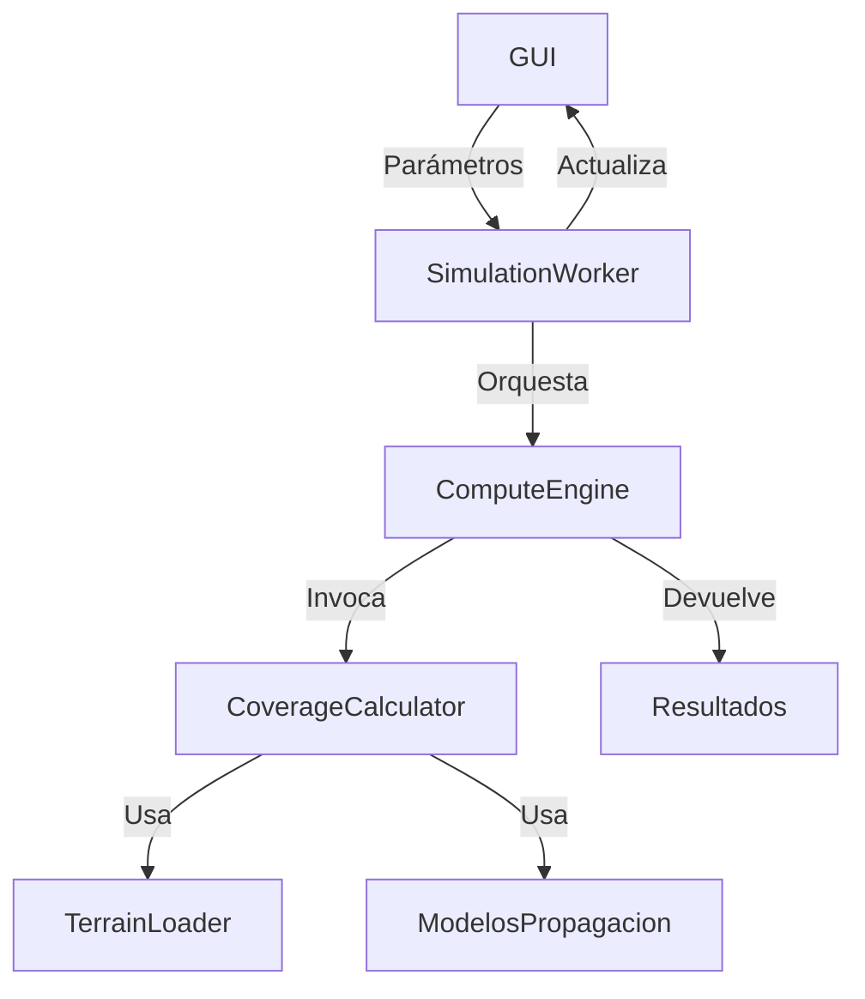

# Núcleo de Cómputo y Pipeline de Simulación

**Versión:** 2026-05-08

## 1. Introducción
El núcleo de cómputo es responsable de ejecutar las simulaciones de cobertura, gestionando el uso de CPU (NumPy) o GPU (CuPy) según disponibilidad. Esta sección describe la arquitectura, pipeline, abstracciones y comunicación con la GUI.

## 2. Componentes Principales
- **compute_engine.py**: Motor central, selecciona backend (NumPy/CuPy).
- **coverage_calculator.py**: Algoritmos de cálculo de cobertura.
- **simulation_worker.py**: Worker asíncrono para simulaciones.
- **terrain_loader.py**: Carga y preprocesa datos de terreno.
- **export_manager.py**: Exporta resultados.

## 3. Diagrama de Pipeline



## 4. Backend NumPy/CuPy
- Selección automática según hardware.
- Abstracción transparente para el usuario.
- Ejemplo:
```python
import numpy as np
try:
    import cupy as cp
    xp = cp
except ImportError:
    xp = np
# xp es NumPy o CuPy según disponibilidad
```

## 5. Flujos de Datos
- **Entrada:** Parámetros de simulación, datos de terreno, configuración de antenas/modelos.
- **Procesamiento:** Pipeline modular, cada etapa es una clase/módulo.
- **Salida:** Mapas de cobertura, métricas, archivos exportados.

## 6. Ejemplo de Código
```python
# Ejecución de simulación
engine = ComputeEngine(params)
result = engine.run()
```

## 7. Observaciones
- Modularidad y extensibilidad.
- Uso eficiente de recursos (CPU/GPU).
- Integración directa con la GUI vía workers.

---

**Ver también:** [03_MODELOS_PROPAGACION.md](03_MODELOS_PROPAGACION.md) para detalles de los modelos.
