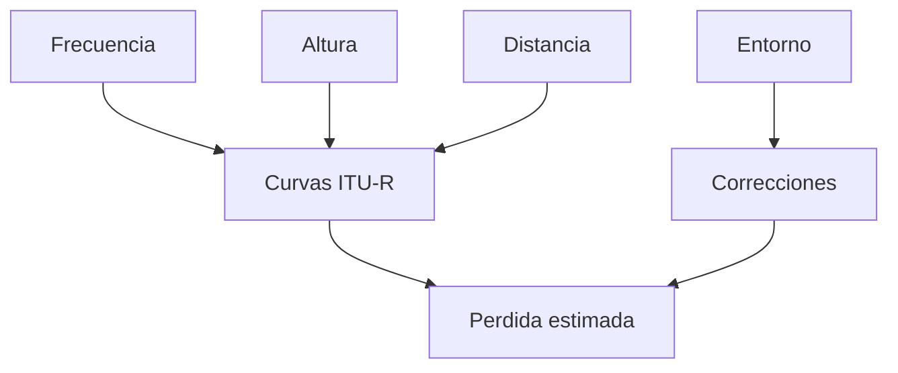

# Modelo ITU-R P.1546

**Versión:** 2026-05-08

## 1. Introduccion
ITU-R P.1546 es una recomendacion empirica para prediccion punto-area en servicios terrestres. Se apoya en curvas de propagacion y factores de correccion asociados a frecuencia, altura de antena y entorno.

## 2. Naturaleza del Modelo
A diferencia de un modelo puramente algebraico simple, P.1546 utiliza interpolacion y correcciones para aproximar la potencia recibida en funcion de condiciones del trayecto y del escenario.

## 3. Variables Principales
- Frecuencia
- Distancia
- Altura efectiva de antena
- Tipo de terreno/entorno
- Probabilidad o porcentaje de tiempo cuando aplica

## 4. Enfoque Conceptual

## 5. Salidas
- Nivel de campo o perdida equivalente
- Estimacion de cobertura punto-area
- Valor apto para mapas de calor probabilisticos

## 6. Ventajas
- Flexible para evaluaciones de servicio terrestre.
- Mejor adaptacion a escenarios con dependencia de altura y entorno.
- Adecuado para estudios mas cercanos a regulacion o planificacion.

## 7. Limitaciones
- Requiere interpretacion cuidadosa de sus curvas y tablas.
- Puede ser mas costoso de parametrizar que un modelo algebraico simple.

## 8. Uso en el Sistema
La capa de calculo lo aplica cuando el usuario selecciona un modelo ITU para un estudio de cobertura mas realista a escala de servicio.

---

**Ver tambien:** [03_MODELOS_PROPAGACION.md](03_MODELOS_PROPAGACION.md)
