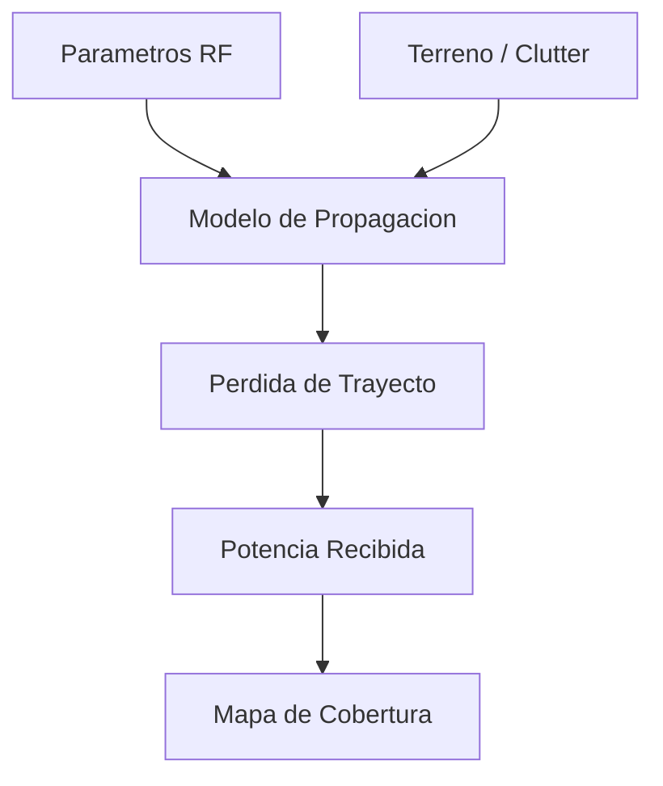

# Modelos de Propagacion

**Versión:** 2026-05-08

## 1. Propósito
Este conjunto de documentos describe los modelos de propagacion soportados por el sistema de simulacion de cobertura. Cada modelo estima la perdida de trayecto y contribuye al calculo de la potencia recibida, la cobertura y el mapa de calor final.

## 2. Flujo Conceptual

## 3. Variables Comunes
- Frecuencia $f$
- Distancia $d$
- Altura de antena transmisora $h_{tx}$
- Altura de antena receptora $h_{rx}$
- Ganancia de antena $G_{tx}, G_{rx}$
- Potencia transmitida $P_{tx}$
- Factores de entorno y correccion

## 4. Ecuacion General
En todos los modelos, la potencia recibida puede expresarse de forma simplificada como:

$$
P_{rx} = P_{tx} + G_{tx} + G_{rx} - L_{path} - L_{misc}
$$

donde $L_{path}$ es la perdida de propagacion calculada por el modelo y $L_{misc}$ agrupa perdidas adicionales.

## 5. Modelos Disponibles
- [03E_FREE_SPACE.md](03E_FREE_SPACE.md)
- [03A_OKUMURA_HATA.md](03A_OKUMURA_HATA.md)
- [03B_COST231.md](03B_COST231.md)
- [03C_ITU_R_P1546.md](03C_ITU_R_P1546.md)
- [03D_3GPP_38901.md](03D_3GPP_38901.md)

## 6. Criterios de Seleccion
- **Free Space:** linea de vista ideal, sin obstrucciones.
- **Okumura-Hata:** entornos urbanos/suburbanos con rangos clasicos de frecuencias.
- **COST-231:** extension de Okumura-Hata para frecuencias mas altas y entornos metropolitanos.
- **ITU-R P.1546:** prediccion empirica para servicios terrestres punto-area.
- **3GPP TR 38.901:** escenarios modernos LTE/5G con modelos estadisticos y dependientes del entorno.

## 7. Integracion en el Sistema
Los modelos se implementan en el subarbol de `src/core/models/` y se consumen desde el calculo de cobertura. El motor selecciona el modelo solicitado por el usuario y aplica sus parametros al grid de simulacion.

## 8. Validacion
Cada modelo dispone de pruebas especificas en `tests/` que verifican rangos, valores de referencia y consistencia de unidades.

---

**Siguiente lectura recomendada:** [02_CORE_COMPUTE.md](02_CORE_COMPUTE.md) y luego el modelo especifico requerido.
