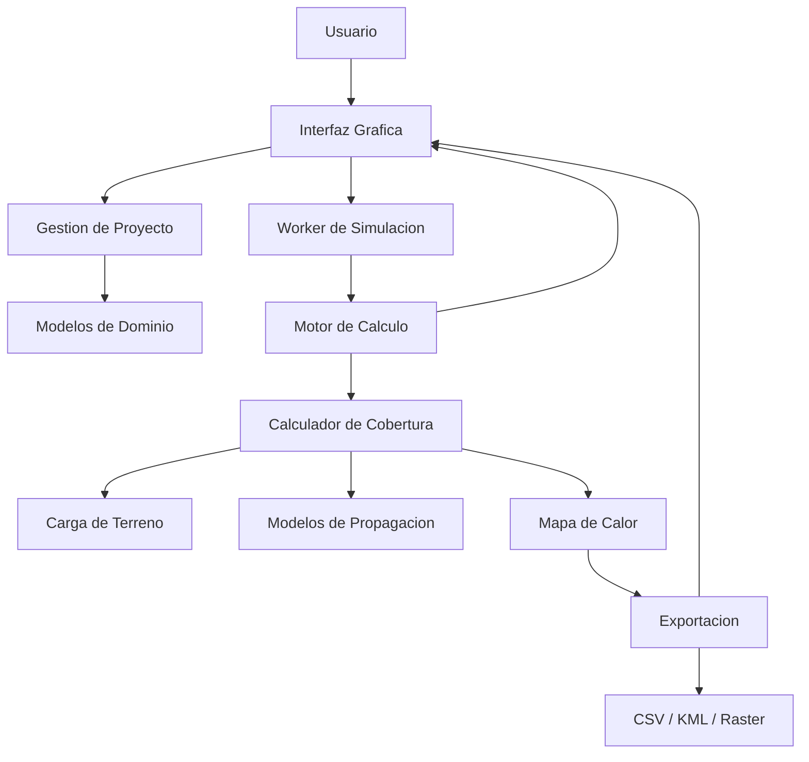

# Interconexion y Orquestacion del Sistema

**Versión:** 2026-05-08

## 1. Objetivo
Este documento describe como se conectan entre si los modulos principales del sistema: interfaz grafica, gestor de proyectos, motor de calculo, modelos de propagacion, carga de terreno, exportacion y validacion. El objetivo es mostrar el flujo extremo a extremo desde la entrada del usuario hasta la generacion de resultados.

## 2. Vista de Alto Nivel

## 3. Capas Funcionales

### 3.1 Capa de Presentacion
La GUI concentra la interaccion con el usuario. Recibe proyectos, parametros, configuraciones de simulacion y solicitudes de exportacion. No calcula cobertura directamente; delega esa tarea al worker y al motor de calculo.

### 3.2 Capa de Orquestacion
La orquestacion la realizan `MainWindow`, los paneles de proyecto y `SimulationWorker`. Esta capa traduce acciones de usuario en objetos de dominio y parametros de ejecucion.

### 3.3 Capa de Dominio
Los modelos de dominio encapsulan entidades como proyecto, sitio y antena. Estos objetos viajan por el sistema como la representacion formal de la configuracion de simulacion.

### 3.4 Capa de Calculo
`ComputeEngine` y `CoverageCalculator` ejecutan el pipeline numerico. Aqui se integran backend NumPy/CuPy, terreno, modelos de propagacion y grillas de calculo.

### 3.5 Capa de Persistencia y Salida
`ExportManager` transforma los resultados en archivos utiles para analisis externo: CSV, KML, raster u otros formatos compatibles.

## 4. Flujo E2E de una Simulacion

1. El usuario abre o crea un proyecto desde la GUI.
2. Se cargan parametros de sitio, antena, entorno y modelo de propagacion.
3. La GUI crea la solicitud de simulacion y la pasa al worker.
4. `SimulationWorker` invoca el motor de calculo sin bloquear la interfaz.
5. `ComputeEngine` selecciona el backend disponible y prepara los datos.
6. `CoverageCalculator` obtiene terreno, geometria y parametros RF.
7. El modelo de propagacion devuelve la perdida de trayecto por celda.
8. Se calcula la potencia recibida y la cobertura resultante.
9. La GUI recibe el resultado y actualiza el mapa, metricas y paneles.
10. Si el usuario lo solicita, `ExportManager` serializa los resultados.

## 5. Entradas y Salidas por Bloque

### 5.1 GUI
- **Entradas:** archivos de proyecto, parametros del usuario, configuracion de visualizacion.
- **Salidas:** objetos de simulacion, ordenes de ejecucion, peticiones de exportacion.

### 5.2 SimulationWorker
- **Entradas:** parametros validados de simulacion.
- **Salidas:** resultados intermedios, progreso, estado final.

### 5.3 ComputeEngine
- **Entradas:** parametros numericos, backend seleccionado, grid de trabajo.
- **Salidas:** buffers numericos y matrices de resultado.

### 5.4 CoverageCalculator
- **Entradas:** terreno, geometria de antenas, frecuencia, modelo de propagacion.
- **Salidas:** perdida de trayecto, potencia recibida, cobertura agregada.

### 5.5 ExportManager
- **Entradas:** resultados finales y metadatos de simulacion.
- **Salidas:** archivos de exportacion.

## 6. Dependencias Clave

- La GUI depende de la capa de dominio para persistir y recuperar configuraciones.
- El worker depende del motor de calculo para no ejecutar la simulacion en el hilo principal.
- El motor de calculo depende de los modelos de propagacion y del terreno.
- El exportador depende de los resultados del calculo y de los metadatos del proyecto.

## 7. Puntos de Extension

- Nuevos modelos de propagacion pueden incorporarse sin modificar la GUI si respetan la interfaz del motor.
- Nuevos formatos de exportacion pueden agregarse en `ExportManager`.
- Nuevos paneles de configuracion pueden sumarse a la GUI sin alterar el pipeline numerico.

## 8. Riesgos Tecnicos

- Inconsistencias de unidades entre GUI, dominio y motor de calculo.
- Bloqueo de interfaz si una simulacion pesada no se ejecuta en worker.
- Desalineacion entre modelo seleccionado y parametros de entrada.
- Diferencias entre resultados en CPU y GPU si no se validan correctamente.

## 9. Resumen Operativo
El sistema esta desacoplado por capas y utiliza workers para mantener la interfaz responsiva. La integracion se apoya en objetos de dominio y en contratos de entrada/salida entre modulos, lo que facilita extensiones futuras y reduce el acoplamiento directo.

---

**Siguiente documento sugerido:** [05_EXPORTACION.md](05_EXPORTACION.md) para detallar formatos, transformaciones y metadatos de salida.
