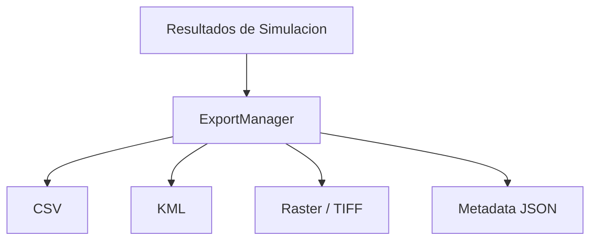

# Sistema de Exportacion

**Versión:** 2026-05-08

## 1. Objetivo
El sistema de exportacion transforma los resultados de simulacion en artefactos reutilizables fuera de la aplicacion. Esto incluye datos tabulares, capas geoespaciales y metadatos de ejecucion.

## 2. Rol en la Arquitectura
`ExportManager` actua como la frontera entre el resultado numerico interno y los formatos externos de analisis.

## 3. Entradas
- Matrices de cobertura.
- Metadatos del proyecto.
- Informacion de terreno.
- Configuracion de exportacion definida por el usuario.

## 4. Salidas
- Archivos CSV con estadisticas o series de datos.
- Archivos KML para visualizacion geografica.
- Archivos raster para analisis espacial.
- JSON de metadata con parametros de ejecucion.

## 5. Estructura de Exportacion
El proceso de exportacion normalmente sigue estos pasos:

1. Normalizar resultados numericos.
2. Asociar coordenadas y metadatos.
3. Serializar segun el formato solicitado.
4. Verificar integridad de los archivos generados.
5. Registrar ubicacion y nombre de salida.

## 6. Consideraciones Tecnicas
- Los formatos geoespaciales deben mantener coherencia de proyeccion.
- La metadata debe incluir modelo, frecuencia, altura de antenas y fecha de simulacion.
- El exportador no debe alterar la solucion numerica original.

## 7. Integracion con la GUI
La interfaz puede iniciar exportaciones al finalizar una simulacion o desde una accion manual del usuario. El resultado debe mostrarse en pantalla con confirmacion de exito o error.

## 8. Relacion con Validacion
Cada exportacion debe ser consistente con la validacion previa de la simulacion. Si el resultado de la simulacion es invalido, el sistema no deberia producir artefactos finales sin advertencia.

## 9. Resumen
`ExportManager` es el punto de salida formal del sistema y permite reutilizar resultados en herramientas GIS, hojas de calculo y flujos de documentacion tecnica.

---

**Ver tambien:** [04_INTERCONEXION.md](04_INTERCONEXION.md) y [05_VALIDACION.md](05_VALIDACION.md)
