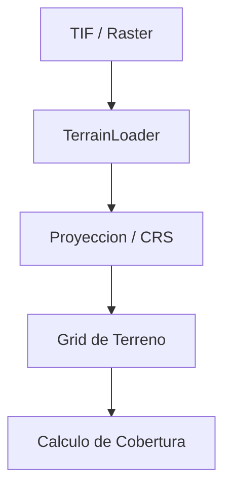

# Terreno y Cartografia

**Versión:** 2026-05-08

## 1. Objetivo
El subsistema de terreno aporta la base espacial sobre la cual se calcula la cobertura. Incluye lectura de raster, transformaciones de coordenadas, asociacion de alturas y soporte para analisis geoespacial.

## 2. Componente Principal
`TerrainLoader` se encarga de abrir, interpretar y preparar archivos de elevacion para el motor de simulacion.

## 3. Flujo de Datos

## 4. Entradas
- Archivos raster de elevacion.
- Metadatos de proyeccion.
- Parametros de recorte o region de interes.

## 5. Salidas
- Matriz de alturas.
- Informacion de CRS y transformacion.
- Datos preparados para el pipeline numerico.

## 6. Responsabilidades Tecnicas
- Validar que el raster pueda abrirse correctamente.
- Mantener la relacion entre pixeles y coordenadas geograficas.
- Proveer datos consistentes para el modelo de propagacion y el calculo de distancia efectiva.

## 7. Relacion con la Cobertura
El terreno influye sobre visibilidad, obstruccion y ajuste espacial del resultado. Aunque el modelo de propagacion tenga una formula principal, el terreno modifica la interpretacion final de la cobertura.

## 8. Fallos Tipicos
- Raster corrupto o inaccesible.
- CRS no compatible.
- Extensiones geograficas mal definidas.
- Valores de elevacion faltantes o invalidos.

## 9. Resumen
El subsistema de terreno asegura que el calculo de cobertura no se haga sobre supuestos abstractos sino sobre un soporte geoespacial realista.

---

**Ver tambien:** [02_CORE_COMPUTE.md](02_CORE_COMPUTE.md) y [04_INTERCONEXION.md](04_INTERCONEXION.md)
