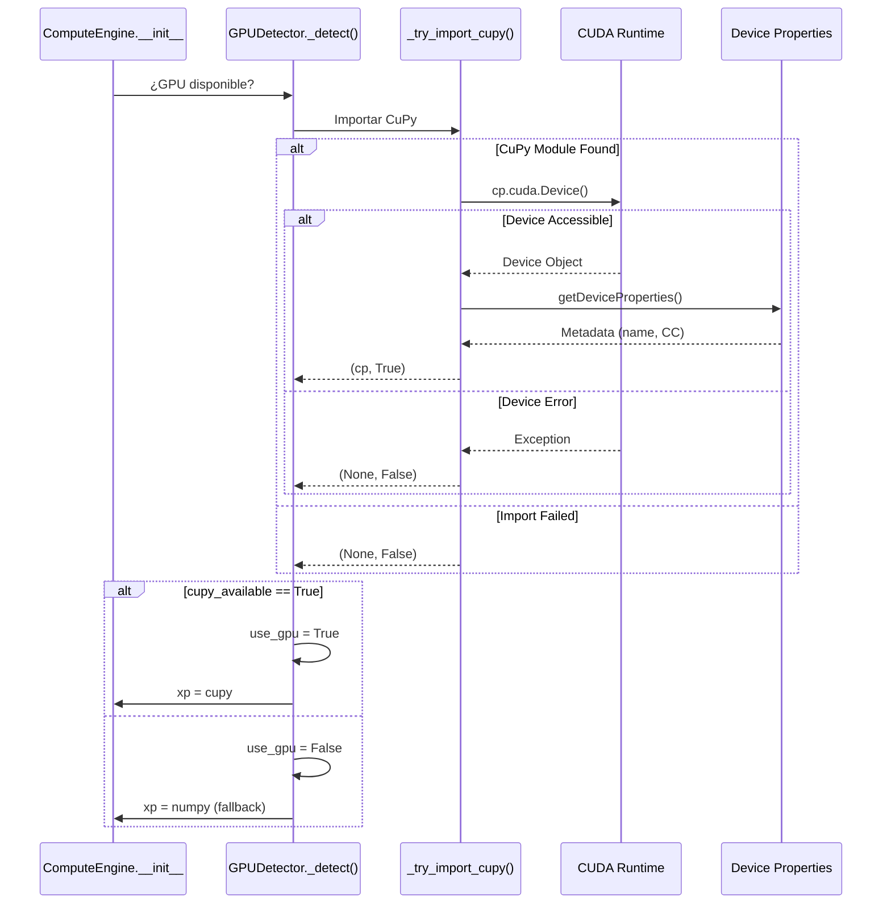

# Detección de GPU y Hardware de Aceleración

**Versión:** 2026-05-08

## 1. Propósito

El subsistema de detección de GPU (`gpu_detector.py`) es responsable de identificar automáticamente la disponibilidad de CUDA en el sistema y seleccionar el backend de cómputo correcto (NumPy para CPU, CuPy para GPU). Este proceso es silencioso, seguro y proporciona fallback automático sin requerir intervención del usuario.

## 2. Rol en la Arquitectura

```
┌──────────────────────────────────────┐
│ Aplicación Inicia                    │
└────────────┬─────────────────────────┘
             │
             ↓
┌──────────────────────────────────────┐
│ ComputeEngine.__init__()             │
│ use_gpu=True (solicitado)            │
└────────────┬─────────────────────────┘
             │
             ↓
┌──────────────────────────────────────┐
│ GPUDetector._detect()                │ ← Este documento
│ ¿CuPy disponible?                    │
└────┬─────────────────┬───────────────┘
     │ SÍ              │ NO
     ↓                 ↓
┌──────────────┐   ┌──────────────┐
│ xp = cupy    │   │ xp = numpy   │ (fallback)
│ GPU Mode ON  │   │ CPU Mode ON  │
└──────────────┘   └──────────────┘
```

## 3. Flujo de Detección Segura

### 3.1 Diagrama de Secuencia



### 3.2 Puntos Clave de Seguridad

1. **Import Seguro**: Toda excepción capturada (ImportError, RuntimeError, etc.)
2. **Device Test**: Verificación real de acceso a CUDA con `cp.cuda.Device()`
3. **Propiedades Opcionales**: Intento de leer metadata sin fallar si no está disponible
4. **Fallback Silencioso**: Sin crashes, logging informativo
5. **Cache Global**: Evita re-imports innecesarios

## 4. Implementación en Código

### 4.1 Módulo Global de Variables Cache

**Ubicación**: `src/utils/gpu_detector.py`, líneas 1-20

```python
# Variables globales para caching (evita re-imports)
_cupy_checked = False
_cupy_module = None
_cupy_available = False
_device_cache = {}

def _try_import_cupy():
    """
    Intenta importar CuPy y verificar acceso a GPU.
    Retorna (cupy_module, is_available) ó (None, False).
    
    Utiliza cache global para evitar re-imports costosos.
    """
    global _cupy_checked, _cupy_module, _cupy_available
    
    # Primer check: si ya se verificó antes, retornar resultado cacheado
    if _cupy_checked:
        return _cupy_module, _cupy_available
    
    _cupy_checked = True  # Marcar como verificado
    
    try:
        import cupy as cp
        import logging
        
        # PASO 1: Importación del módulo
        logging.info("CuPy module found")
        
        # PASO 2: Verificar que GPU está realmente accesible
        device = cp.cuda.Device()  # Acceso real a CUDA
        logging.info(f"CUDA Device {device.id} accessible")
        
        # PASO 3: Intentar obtener información del dispositivo
        try:
            props = cp.cuda.runtime.getDeviceProperties(device.id)
            device_name = props.get('name', b'Unknown').decode('utf-8')
            logging.info(f"GPU Device: {device_name}")
        except Exception as e:
            logging.warning(f"Could not read device properties: {e}")
            device_name = f"CUDA Device {device.id}"
        
        _cupy_module = cp
        _cupy_available = True
        
        return cp, True
        
    except ImportError as e:
        # CuPy no está instalado
        logging.info(f"CuPy not installed: {e}")
        _cupy_module = None
        _cupy_available = False
        return None, False
        
    except RuntimeError as e:
        # CUDA disponible pero no accesible (ej: driver viejo)
        logging.warning(f"CUDA not accessible: {e}")
        _cupy_module = None
        _cupy_available = False
        return None, False
        
    except Exception as e:
        # Cualquier otro error
        logging.error(f"Unexpected error detecting GPU: {type(e).__name__}: {e}")
        _cupy_module = None
        _cupy_available = False
        return None, False
```

### 4.2 Clase GPUDetector Principal

**Ubicación**: `src/utils/gpu_detector.py`, líneas 50-150

```python
class GPUDetector(QObject):
    """
    Detector de GPU y selector de backend numérico.
    
    Proporciona:
    - Detección automática y segura de CUDA
    - Fallback silencioso a NumPy
    - Información del dispositivo
    - Métodos para cambiar backend en runtime
    """
    
    # Señal PyQt: emitida cuando cambia disponibilidad de GPU
    gpu_status_changed = pyqtSignal(bool)  # True=GPU disponible, False=fallback a CPU
    
    def __init__(self):
        super().__init__()
        
        self.cupy_available = False
        self.device_name = "CPU (No CUDA)"
        self.device_info = {}
        
        # Ejecutar detección
        self._detect()
    
    def _detect(self):
        """Ejecuta la secuencia de detección"""
        try:
            cp, available = _try_import_cupy()
            
            if not available:
                self.cupy_available = False
                self.device_name = "CPU (No CUDA)"
                return
            
            # GPU detectado exitosamente
            self.cupy_available = True
            
            # Obtener información del dispositivo
            device = cp.cuda.Device()
            self.device_info = {
                'id': device.id,
                'compute_capability': device.compute_capability,
                'pci_bus_id': device.pci_bus_id,
            }
            
            # Intentar obtener nombre del dispositivo
            try:
                props = cp.cuda.runtime.getDeviceProperties(device.id)
                self.device_name = props.get('name', b'CUDA Device').decode('utf-8')
            except:
                self.device_name = f"CUDA Device {device.id}"
            
        except Exception as e:
            logging.error(f"Unexpected error in GPU detection: {e}")
            self.cupy_available = False
            self.device_name = "CPU (Fallback due to error)"
    
    def get_compute_module(self):
        """
        Retorna módulo numérico adecuado.
        
        Returns:
            cupy: si GPU está disponible
            numpy: si GPU no disponible (fallback)
        """
        if self.cupy_available:
            cp, available = _try_import_cupy()
            if available:
                return cp
        
        import numpy as np
        return np
    
    def get_device_info_string(self):
        """Retorna información del dispositivo como string formateado"""
        if not self.cupy_available:
            return "CPU (No CUDA available)"
        
        info = f"GPU: {self.device_name}"
        
        # Agregar Compute Capability si disponible
        if 'compute_capability' in self.device_info:
            cc_major, cc_minor = self.device_info['compute_capability']
            info += f" (CC {cc_major}.{cc_minor})"
        
        return info
    
    @property
    def has_cuda(self):
        """Propiedad: ¿CUDA disponible?"""
        return self.cupy_available
    
    @property
    def cuda_device_id(self):
        """Propiedad: ID del dispositivo CUDA"""
        return self.device_info.get('id', -1)
    
    @property
    def compute_capability(self):
        """Propiedad: Compute Capability (major, minor)"""
        return self.device_info.get('compute_capability', (0, 0))
```

## 5. Información del Dispositivo Capturada

### 5.1 Compute Capability (CC)

La Compute Capability de NVIDIA indica la "generación" de GPU:

| CC | Arquitectura | Año | Ejemplos |
|----|--------------|-----|---------|
| 3.0-3.5 | Kepler | 2012-2014 | GTX 650, GTX 750 Ti |
| 5.0-5.3 | Maxwell | 2014-2016 | GTX 750 Ti, GTX 960 |
| 6.0-6.2 | Pascal | 2016-2017 | GTX 1060, GTX 1080 |
| 7.0-7.5 | Turing | 2018-2019 | RTX 2060, GTX 1660 |
| 8.0-8.6 | Ampere | 2020-2021 | RTX 3060, RTX 3080 |

**Uso en el código**: Validar si el dispositivo soporta características requeridas. CCs inferiores pueden tener limitaciones.

### 5.2 Ejemplo Real: NVIDIA GeForce GTX 1660 SUPER

```python
device_info = {
    'id': 0,                              # Device index (0 = primer GPU)
    'compute_capability': (7, 5),         # CC 7.5 = Turing
    'pci_bus_id': '01:00.0',              # Ubicación en bus PCI
}
device_name = "NVIDIA GeForce GTX 1660 SUPER"
get_device_info_string()
# → "GPU: NVIDIA GeForce GTX 1660 SUPER (CC 7.5)"
```

## 6. Manejo de Fallback

### 6.1 Escenarios de Fallback

**Escenario 1**: CuPy no instalado
```
ImportError: No module named 'cupy'
  ↓
_try_import_cupy() captura excepción
  ↓
Retorna (None, False)
  ↓
GPUDetector.cupy_available = False
  ↓
ComputeEngine.use_gpu = False
  ↓
xp = numpy ✅ (fallback silencioso)
```

**Escenario 2**: CUDA no disponible (driver viejo/ausente)
```
RuntimeError: CUDA runtime not initialized
  ↓
_try_import_cupy() captura excepción
  ↓
Retorna (None, False)
  ↓
GPU modo deshabilitado, usa NumPy ✅
```

**Escenario 3**: GPU sin acceso (ej: en sesión remota)
```
RuntimeError: Could not get device handle
  ↓
Fallback a CPU ✅
```

### 6.2 Código de Fallback en ComputeEngine

**Ubicación**: `src/core/compute_engine.py`, líneas 15-35

```python
class ComputeEngine(QObject):
    def __init__(self, use_gpu: bool = True):
        super().__init__()
        
        # Crear detector
        self.gpu_detector = GPUDetector()
        
        # Intentar usar GPU si fue solicitado
        self.use_gpu = use_gpu and self.gpu_detector.cupy_available
        
        # Asignar módulo numérico
        if self.use_gpu:
            self.xp = self.gpu_detector.get_compute_module()
            logging.info(f"Using GPU: {self.gpu_detector.get_device_info_string()}")
        else:
            import numpy as np
            self.xp = np
            logging.info("Using CPU (NumPy)")
        
        self.logger = logging.getLogger(__name__)
    
    def switch_compute_mode(self, use_gpu: bool) -> bool:
        """
        Cambiar CPU/GPU en runtime.
        
        Args:
            use_gpu: True para intentar usar GPU, False para CPU
        
        Returns:
            True si el cambio fue exitoso, False si GPU no disponible
        """
        if use_gpu and not self.gpu_detector.cupy_available:
            logging.warning("GPU requested but not available - staying on CPU")
            return False
        
        old_mode = self.use_gpu
        self.use_gpu = use_gpu
        
        if self.use_gpu:
            self.xp = self.gpu_detector.get_compute_module()
        else:
            import numpy as np
            self.xp = np
        
        if old_mode != self.use_gpu:
            logging.info(f"Switched compute mode: {old_mode} → {self.use_gpu}")
        
        return True
```

## 7. Validaciones Críticas

### 7.1 Checklist de Validación

- ✅ CuPy module importable
- ✅ CUDA runtime inicializado
- ✅ Device accesible (no bloqueado)
- ✅ Properties legibles (CC, nombre)
- ✅ Memoria GPU disponible
- ✅ Operaciones básicas funcionan (cp.array, cp.sum)

### 7.2 Test Mínimo

```python
def validate_gpu_for_simulation(gpu_detector):
    """Valida que GPU pueda hacer simulación"""
    if not gpu_detector.cupy_available:
        return False, "GPU not available"
    
    try:
        cp = gpu_detector.get_compute_module()
        
        # Test: crear array pequeño en GPU
        test_array = cp.arange(1000)
        result = cp.sum(test_array)
        
        # Verificar que el resultado sea correcto
        expected = 999 * 1000 / 2
        if abs(result - expected) > 1e-6:
            return False, "GPU computation incorrect"
        
        return True, "GPU validated"
    
    except Exception as e:
        return False, f"GPU validation failed: {e}"
```

## 8. Logging y Debugging

**Ubicación**: `src/utils/logger.py`

Mensajes típicos que el usuario verá:

```
INFO: CuPy module found
INFO: CUDA Device 0 accessible
INFO: GPU Device: NVIDIA GeForce GTX 1660 SUPER
INFO: Using GPU: GPU: NVIDIA GeForce GTX 1660 SUPER (CC 7.5)

--- o en fallback ---

INFO: CuPy not installed: No module named 'cupy'
INFO: Using CPU (NumPy)
```

## 9. Resumen

| Aspecto | Descripción |
|---------|------------|
| **Responsabilidad** | Detectar GPU/CUDA automáticamente y proporcionar backend |
| **Seguridad** | Fallback silencioso sin crashes |
| **Información** | Device name, Compute Capability, Device ID |
| **Caching** | Global `_cupy_checked` evita re-imports |
| **Integración** | Via `ComputeEngine`, selector agnóstico de backend |

---

**Ver también**: [02_CORE_COMPUTE.md](02_CORE_COMPUTE.md), [09_PIPELINE_SIMULACION_FLUJO.md](09_PIPELINE_SIMULACION_FLUJO.md)
