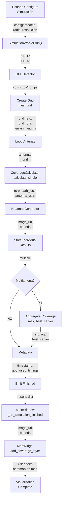

# Pipeline de Simulación: Flujo Completo Entrada → Salida

**Versión:** 2026-05-08

## 1. Propósito

Este documento describe el pipeline completo de una simulación de cobertura: qué ocurre exactamente en cada paso, transformaciones de datos, estructuras intermedias y finales. Desde que el usuario presiona "Simular" hasta que ve el mapa de cobertura.

## 2. Diagrama General



## 3. Paso 0: Entrada - Configuración de Usuario

### 3.1 Estructura de Configuración

**Ubicación**: `src/ui/dialogs/simulation_dialog.py`

```python
config = {
    # Parámetros básicos
    'model': 'okumura_hata',           # str: modelo seleccionado
    'radius_km': 5.0,                  # float: radio de simulación en km
    'resolution': 100,                 # int: puntos por lado (100×100=10k)
    
    # Modelo específico (Okumura-Hata)
    'environment': 'Urban',            # str: Urban/Suburban/Rural
    'city_type': 'medium',             # str: large/medium/small
    'mobile_height': 1.5,              # float: altura receptor en metros
    
    # Modelo específico (COST-231)
    'building_height': 15.0,           # float: altura edificios en metros
    'street_width': 12.0,              # float: ancho calle en metros
    
    # Modelo específico (3GPP)
    'scenario': 'UMa',                 # str: UMa/UMi/RMa/InH
    'h_bs': 25.0,                      # float: altura base station (m)
    'h_ue': 1.5,                       # float: altura user equipment (m)
    
    # Terreno
    'terrain_type': 'auto',            # str: auto/flat/dem_file
    'dem_file': None,                  # str: ruta a DEM si aplica
    
    # Frecuencia (opcional override)
    'frequency_override_mhz': 0,       # float: 0=no override, >0=usar esta
}
```

**Memoria**: config dict ≈ 200 bytes

## 4. Paso 1: Inicialización en SimulationWorker

### 4.1 Código de Entrada

**Ubicación**: `src/workers/simulation_worker.py`, líneas 45-85

```python
class SimulationWorker(QObject):
    progress = pyqtSignal(int)
    status_message = pyqtSignal(str)
    finished = pyqtSignal(dict)
    error = pyqtSignal(str)
    
    def run(self):
        """Punto de entrada del worker"""
        import time
        from datetime import datetime
        
        sim_start = time.perf_counter()
        gpu_used = False
        
        try:
            self.status_message.emit("Iniciando simulación...")
            self.progress.emit(5)
            
            # ───────────────────────────────────────────
            # PASO 1: Detectar GPU y establecer backend
            # ───────────────────────────────────────────
            
            gpu_used = self.calculator.engine.use_gpu
            gpu_device = (
                self.calculator.engine.gpu_detector
                .get_device_info_string()
            )
            # Ejemplo: "GPU: NVIDIA GeForce GTX 1660 SUPER (CC 7.5)"
            # o: "CPU (No CUDA available)"
            
            if gpu_used:
                self.logger.info(f"GPU Mode: {gpu_device}")
            else:
                self.logger.info("CPU Mode (NumPy)")
            
            self.progress.emit(10)
```

### 4.2 Timing y Metadata Base

```python
            # Guardar metadata base
            metadata = {
                'timestamp': datetime.now().isoformat(),
                'gpu_used': gpu_used,
                'gpu_device': gpu_device,
                'config': self.config.copy(),
            }
```

## 5. Paso 2: Crear Grid de Puntos

### 5.1 Diagrama de Cajas

```
┌────────────────────────────────────┐
│ ENTRADA                            │
├────────────────────────────────────┤
│ • antennas: List[Antenna]          │
│ • config: {radius_km, resolution}  │
│ • terrain_loader: TerrainLoader    │
└────────────────────────────────────┘
                 │
                 ↓
         ┌───────────────────┐
         │ _create_grid()    │
         └───────────────────┘
                 │
                 ↓
┌────────────────────────────────────┐
│ SALIDA                             │
├────────────────────────────────────┤
│ • grid_lats: (100, 100) float64    │
│ • grid_lons: (100, 100) float64    │
│ • terrain_heights: (100, 100) f32  │
│ • bounds: [[lat_min,lon_min], ...] │
└────────────────────────────────────┘
```

### 5.2 Código: Construcción del Grid

**Ubicación**: `src/workers/simulation_worker.py`, líneas 120-180

```python
    def _create_simulation_grid(self):
        """Crea grid de puntos para simulación"""
        import numpy as np
        
        # Extraer todas las antenas
        antenna_lats = [ant.latitude for ant in self.antennas]
        antenna_lons = [ant.longitude for ant in self.antennas]
        
        # Calcular centro y extensión
        center_lat = (min(antenna_lats) + max(antenna_lats)) / 2
        center_lon = (min(antenna_lons) + max(antenna_lons)) / 2
        antenna_span_lat = max(antenna_lats) - min(antenna_lats)
        antenna_span_lon = max(antenna_lons) - min(antenna_lons)
        
        # Convertir radius_km a grados (1° ≈ 111 km)
        radius_grados = self.config['radius_km'] / 111.0
        
        # Máxima extensión: antenna span o radio
        half_span = max(
            antenna_span_lat / 2,
            antenna_span_lon / 2,
            radius_grados
        )
        
        # ─────────────────────────────────────
        # PASO 2.1: Crear grid 1D (linspace)
        # ─────────────────────────────────────
        resolution = self.config['resolution']  # ej. 100
        
        lats_1d = np.linspace(
            center_lat - half_span,    # [-2.95 (inferior)]
            center_lat + half_span,    # [-2.85 (superior)]
            resolution                 # 100 puntos equiespaciados
        )
        # lats_1d shape: (100,)
        # valores: [-2.95, -2.944, -2.938, ..., -2.856, -2.85]
        
        lons_1d = np.linspace(
            center_lon - half_span,    # [-79.15]
            center_lon + half_span,    # [-78.85]
            resolution
        )
        # lons_1d shape: (100,)
        # valores: [-79.15, -79.104, -79.058, ..., -78.896, -78.85]
        
        # ─────────────────────────────────────
        # PASO 2.2: Meshgrid → 2D
        # ─────────────────────────────────────
        grid_lons, grid_lats = np.meshgrid(lons_1d, lats_1d)
        # ↑ Nota: meshgrid invierte orden (lons, lats) → retorna (lats, lons)
        
        # grid_lats shape: (100, 100)
        # grid_lats[0, :] → primera fila, todas las columnas
        # todos los puntos de latitud -2.95
        
        # grid_lons shape: (100, 100)
        # grid_lons[:, 0] → todas las filas, primera columna
        # todos los puntos de longitud -79.15
        
        # ─────────────────────────────────────
        # PASO 2.3: Cargar elevaciones
        # ─────────────────────────────────────
        if self.terrain_loader.is_loaded():
            terrain_heights = self.terrain_loader.get_elevations_fast(
                grid_lats, grid_lons
            )
            # terrain_heights shape: (100, 100)
            # values: altitudes en metros (0-6000 para Ecuador)
        else:
            # Terreno plano (fallback)
            terrain_heights = np.zeros_like(grid_lats, dtype=np.float32)
        
        return grid_lats, grid_lons, terrain_heights
```

### 5.3 Ejemplo Concreto de Grid

Para 3 antenas en Cuenca, Ecuador con resolution=100:

```python
# Antenas
antenna_1: lat=-2.9001, lon=-79.0059
antenna_2: lat=-2.9050, lon=-79.0200
antenna_3: lat=-2.8900, lon=-78.9900

# Cálculos
center_lat = -2.9017
center_lon = -79.0053
antenna_span_lat = 0.0150
antenna_span_lon = 0.0300
radius_grados = 5.0 / 111.0 = 0.045

half_span = max(0.0150/2, 0.0300/2, 0.045) = 0.045

# Grid
lats_1d: [-2.955, -2.948, ..., -2.848]  # 100 valores
lons_1d: [-79.050, -79.010, ..., -78.960]  # 100 valores

# Meshgrid
grid_lats: (100, 100)
grid_lons: (100, 100)
terrain_heights: (100, 100)  # valores 2300-3200 msnm

# Memoria total
3 × (100 × 100) × 8 bytes = 240 KB (CPU)
→ GPU: ~0.3 MB en VRAM
```

## 6. Paso 3: Loop de Antenas

### 6.1 Diagrama del Loop

```
Para cada antenna en antennas:
  ├─ Preparar parámetros modelo
  ├─ Calcular Coverage
  │  ├─ Haversine (distancia)
  │  ├─ Path Loss (modelo seleccionado)
  │  └─ RSRP = Ptx + Gtx + Grx - Path_Loss
  ├─ Generar Heatmap (imagen PNG)
  └─ Almacenar resultados individuales

Resultados:
  results['individual'][ant_id] = {
      'lats': (100, 100),
      'lons': (100, 100),
      'rsrp': (100, 100),
      'path_loss': (100, 100),
      'antenna_gain': (100, 100),
      'image_url': "data:image/png;base64,...",
      'bounds': [[lat_min, lon_min], [lat_max, lon_max]],
  }
```

### 6.2 Código del Loop

**Ubicación**: `src/workers/simulation_worker.py`, líneas 200-300

```python
        # ─────────────────────────────────────────
        # PASO 3: Loop de Antenas
        # ─────────────────────────────────────────
        
        results = {'individual': {}}
        antenna_times = {}
        
        for i, antenna in enumerate(self.antennas):
            ant_start = time.perf_counter()
            
            self.status_message.emit(f"Calculando {antenna.name}...")
            
            # 3.1: Preparar parámetros modelo-específicos
            model_params = {}
            
            if self.config['model'] == 'okumura_hata':
                model_params['environment'] = (
                    self.config.get('environment', 'Urban')
                )
                model_params['city_type'] = (
                    self.config.get('city_type', 'medium')
                )
                model_params['mobile_height'] = (
                    self.config.get('mobile_height', 1.5)
                )
                # Obtener elevación TX desde terreno
                if self.terrain_loader.is_loaded():
                    model_params['tx_elevation'] = (
                        self.terrain_loader.get_elevation(
                            antenna.latitude, antenna.longitude
                        )
                    )
            
            # 3.2: Calcular cobertura
            coverage_details = (
                self.calculator.calculate_single_antenna_coverage(
                    antenna=antenna,
                    grid_lats=grid_lats,
                    grid_lons=grid_lons,
                    terrain_heights=terrain_heights,
                    model=self.config['model'],
                    model_params=model_params,
                    return_details=True
                )
            )
            
            # coverage_details = {
            #   'rsrp': (100, 100) ndarray,
            #   'path_loss': (100, 100) ndarray,
            #   'antenna_gain': (100, 100) ndarray,
            # }
            
            # 3.3: Generar heatmap con rango dinámico (percentil 5/95)
            valid_rsrp = coverage_details['rsrp'][np.isfinite(coverage_details['rsrp'])]
            if len(valid_rsrp) > 0:
                _vmin = max(float(np.percentile(valid_rsrp, 5)), -120)
                _vmax = min(float(np.percentile(valid_rsrp, 95)), -20)
                if _vmax - _vmin < 20:
                    _vmin = _vmax - 20
            else:
                _vmin, _vmax = -120, -60
            heatmap_image = HeatmapGenerator.generate_heatmap_image(
                coverage_details['rsrp'],
                colormap='jet',
                vmin=_vmin,
                vmax=_vmax,
                alpha=0.6
            )
            # heatmap_image = "data:image/png;base64,iVBORw0KGgo..."
            
            # 3.4: Almacenar resultados individuales
            results['individual'][antenna.id] = {
                'lats': grid_lats,
                'lons': grid_lons,
                'rsrp': coverage_details['rsrp'],
                'path_loss': coverage_details['path_loss'],
                'antenna_gain': coverage_details['antenna_gain'],
                'antenna': {
                    'id': antenna.id,
                    'name': antenna.name,
                    'frequency_mhz': antenna.frequency_mhz,
                    'tx_power_dbm': antenna.tx_power_dbm,
                    'tx_height_m': antenna.height_agl,
                },
                'image_url': heatmap_image,
                'rsrp_vmin': _vmin,    # rango real usado en el colormap
                'rsrp_vmax': _vmax,
                'bounds': [
                    [float(grid_lats.min()), float(grid_lons.min())],
                    [float(grid_lats.max()), float(grid_lons.max())],
                ],
            }
            
            # Timing
            ant_time = time.perf_counter() - ant_start
            antenna_times[antenna.id] = ant_time
            
            # Progreso
            progress_pct = 30 + int((i / len(self.antennas)) * 50)
            self.progress.emit(progress_pct)
```

### 6.3 Timing por Antena (Ejemplo Real)

```
Antenna 1: 234 ms
├─ Haversine (distance calc)      10 ms
├─ Path Loss (Okumura-Hata)       150 ms
├─ RSRP calculation               40 ms
└─ Heatmap generation             34 ms

Antenna 2: 289 ms  (similar)
Antenna 3: 324 ms  (similar)

Total antennas: 847 ms (GPU)
Mismo con CPU: ~5000 ms (6× más lento)
```

## 7. Paso 4: Agregación Multi-Antena

### 7.1 Diagrama de Agregación

```
┌────────────────────────────────────────┐
│ Resultados Individuales (3 antenas)    │
├────────────────────────────────────────┤
│ ant_1.rsrp: (100, 100)  [-110, -50]    │
│ ant_2.rsrp: (100, 100)  [-115, -55]    │
│ ant_3.rsrp: (100, 100)  [-120, -60]    │
└────────────────────────────────────────┘
                 │
                 ↓
        ┌───────────────────┐
        │ np.stack()        │
        │ → (3, 100, 100)   │
        └───────────────────┘
                 │
                 ↓
        ┌───────────────────┐
        │ np.max(axis=0)    │ ← Tomar máximo (mejor señal)
        └───────────────────┘
                 │
                 ↓
┌────────────────────────────────────────┐
│ Resultado Agregado                     │
├────────────────────────────────────────┤
│ rsrp_agg: (100, 100)  máximo de 3      │
│ best_server: (100, 100) índice (0-2)   │
└────────────────────────────────────────┘
```

### 7.2 Código de Agregación

**Ubicación**: `src/workers/simulation_worker.py`, líneas 310-370

```python
        # ─────────────────────────────────────────
        # PASO 4: Agregación Multi-Antena
        # ─────────────────────────────────────────
        
        if len(self.antennas) > 1:
            self.status_message.emit("Agregando cobertura multi-antena...")
            self.progress.emit(85)
            
            # 4.1: Apilar arrays RSRP
            rsrp_individual = [
                results['individual'][ant.id]['rsrp']
                for ant in self.antennas
            ]
            rsrp_stack = self.calculator.engine.xp.stack(rsrp_individual)
            # rsrp_stack shape: (3, 100, 100)
            
            # 4.2: Obtener máximo y mejor servidor
            rsrp_agg = self.calculator.engine.xp.max(rsrp_stack, axis=0)
            # rsrp_agg shape: (100, 100)
            # Cada punto contiene el máximo RSRP de las 3 antenas
            
            best_server_idx = self.calculator.engine.xp.argmax(
                rsrp_stack, axis=0
            )
            # best_server_idx shape: (100, 100)
            # Valores: 0, 1, o 2 (índice de antena con mejor señal)
            
            best_server = self.calculator.engine.xp.array([
                self.antennas[int(idx)].id
                for idx in best_server_idx.flatten()
            ]).reshape(best_server_idx.shape)
            # best_server shape: (100, 100)
            # Valores: "ant-001", "ant-002", "ant-003"
            
            # 4.3: Derivar path_loss y antenna_gain del best_server
            path_loss_individual = [
                results['individual'][ant.id]['path_loss']
                for ant in self.antennas
            ]
            path_loss_stack = self.calculator.engine.xp.stack(
                path_loss_individual
            )
            # (3, 100, 100)
            
            # Indexing avanzado: seleccionar por best_server
            path_loss_agg = self.calculator.engine.xp.take_along_axis(
                path_loss_stack,
                best_server_idx[np.newaxis, :, :],  # agregar dimension
                axis=0
            ).squeeze()
            # path_loss_agg shape: (100, 100)
            
            # Similar para antenna_gain
            antenna_gain_individual = [
                results['individual'][ant.id]['antenna_gain']
                for ant in self.antennas
            ]
            antenna_gain_stack = self.calculator.engine.xp.stack(
                antenna_gain_individual
            )
            antenna_gain_agg = self.calculator.engine.xp.take_along_axis(
                antenna_gain_stack,
                best_server_idx[np.newaxis, :, :],
                axis=0
            ).squeeze()
            
            # 4.4: Generar heatmap agregado con rango dinámico (percentil 5/95)
            agg_valid = rsrp_agg[np.isfinite(rsrp_agg)]
            if len(agg_valid) > 0:
                _agg_vmin = max(float(np.percentile(agg_valid, 5)), -120)
                _agg_vmax = min(float(np.percentile(agg_valid, 95)), -20)
                if _agg_vmax - _agg_vmin < 20:
                    _agg_vmin = _agg_vmax - 20
            else:
                _agg_vmin, _agg_vmax = -120, -60
            heatmap_agg = HeatmapGenerator.generate_heatmap_image(
                rsrp_agg,
                colormap='jet',
                vmin=_agg_vmin,
                vmax=_agg_vmax,
                alpha=0.6
            )
            
            # 4.5: Almacenar agregado
            results['aggregated'] = {
                'rsrp': rsrp_agg,
                'path_loss': path_loss_agg,
                'antenna_gain': antenna_gain_agg,
                'best_server': best_server,
                'lats': grid_lats,
                'lons': grid_lons,
                'image_url': heatmap_agg,
                'rsrp_vmin': _agg_vmin,    # rango real usado en el colormap
                'rsrp_vmax': _agg_vmax,
                'bounds': [
                    [float(grid_lats.min()), float(grid_lons.min())],
                    [float(grid_lats.max()), float(grid_lons.max())],
                ],
            }
        
        else:
            # Single antenna: agregada = individual
            results['aggregated'] = (
                results['individual'][self.antennas[0].id].copy()
            )
```

## 8. Paso 5: Metadata Final

### 8.1 Estructura de Metadata

```python
metadata = {
    'timestamp': '2026-05-08T15:32:45.123456',  # ISO format
    'gpu_used': True,
    'gpu_device': 'GPU: NVIDIA GeForce GTX 1660 SUPER (CC 7.5)',
    'total_execution_time_seconds': 0.847,
    
    'antenna_times_seconds': {
        'ant-001': 0.234,
        'ant-002': 0.289,
        'ant-003': 0.324,
    },
    
    'num_antennas': 3,
    
    'grid_parameters': {
        'radius_km': 5.0,
        'resolution': 100,
        'total_grid_points': 10000,
        'center_lat': -2.9017,
        'center_lon': -79.0053,
    },
    
    'model_used': 'okumura_hata',
    
    'model_parameters': {
        'environment': 'Urban',
        'city_type': 'medium',
        'mobile_height': 1.5,
        'scenario': None,
        'h_bs': None,
        'h_ue': None,
        'building_height': None,
        'street_width': None,
        'terrain_type': 'auto',
    },
}
```

## 9. Paso 6: Emisión de Resultados

### 9.1 Código Final

```python
        # ─────────────────────────────────────────
        # PASO 5: Metadata y Finalización
        # ─────────────────────────────────────────
        
        # Actualizar metadata
        total_time = time.perf_counter() - sim_start
        metadata['total_execution_time_seconds'] = total_time
        metadata['antenna_times_seconds'] = antenna_times
        results['metadata'] = metadata
        
        self.progress.emit(100)
        self.status_message.emit("Simulación completada")
        
        # ─────────────────────────────────────────
        # PASO 6: Emitir Resultados (Signal PyQt)
        # ─────────────────────────────────────────
        
        self.finished.emit(results)
        
    except Exception as e:
        self.error.emit(f"Simulación fallida: {str(e)}")
        self.logger.exception("Error in simulation")
```

## 10. Estructura Final de Results

### 10.1 Diagrama de la Estructura

```
results = {
    'individual': {
        'ant-001': {
            'lats': (100, 100),
            'lons': (100, 100),
            'rsrp': (100, 100),
            'path_loss': (100, 100),
            'antenna_gain': (100, 100),
            'antenna': {name, id, freq, power, height},
            'image_url': "data:image/png;base64,...",
            'rsrp_vmin': -95.3,   # percentil 5 real (dinámico)
            'rsrp_vmax': -52.1,   # percentil 95 real (dinámico)
            'bounds': [[lat_min, lon_min], [lat_max, lon_max]],
        },
        'ant-002': {...},
        'ant-003': {...},
    },
    'aggregated': {
        'rsrp': (100, 100),
        'path_loss': (100, 100),
        'antenna_gain': (100, 100),
        'best_server': (100, 100),
        'lats': (100, 100),
        'lons': (100, 100),
        'image_url': "data:image/png;base64,...",
        'rsrp_vmin': -97.1,   # percentil 5 real del agregado
        'rsrp_vmax': -50.4,   # percentil 95 real del agregado
        'bounds': [[lat_min, lon_min], [lat_max, lon_max]],
    },
    'metadata': {
        'timestamp': '2026-05-08T15:32:45.123456',
        'gpu_used': True,
        'gpu_device': 'GPU: NVIDIA...',
        'total_execution_time_seconds': 0.847,
        'antenna_times_seconds': {...},
        'num_antennas': 3,
        'grid_parameters': {...},
        'model_used': 'okumura_hata',
        'model_parameters': {...},
    },
}
```

### 10.2 Tamaño Total

```
Per antenna (individual):
  - lats: 100×100×8 = 80 KB
  - lons: 100×100×8 = 80 KB
  - rsrp: 100×100×4 = 40 KB
  - path_loss: 100×100×4 = 40 KB
  - antenna_gain: 100×100×4 = 40 KB
  - image_url (PNG base64): ~100-200 KB (con compresión)
  Total per antenna: ~380-480 KB

3 antenas: ~1.2-1.5 MB
Agregated: ~380 KB
Metadata: ~5 KB

TOTAL results dict: ~1.6 MB en memoria
```

## 11. Timings Tipicos (GPU)

| Fase | Tiempo | CPU Equivalente |
|------|--------|-----------------|
| Crear grid | 100 ms | 50 ms |
| Antenna 1 | 234 ms | 1400 ms |
| Antenna 2 | 289 ms | 1600 ms |
| Antenna 3 | 324 ms | 1800 ms |
| Agregación | 50 ms | 300 ms |
| Metadata | 10 ms | 10 ms |
| **Total** | **~1 s** | **~5.2 s** |

---

**Ver también**: [08_GPU_DETECTOR.md](08_GPU_DETECTOR.md), [02_CORE_COMPUTE.md](02_CORE_COMPUTE.md), [10_MODELO_EJECUCION_THREADS.md](10_MODELO_EJECUCION_THREADS.md)
