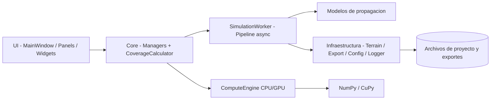
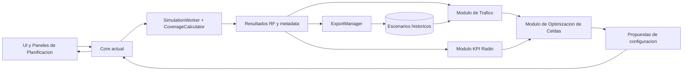

# Arquitectura de la Aplicacion

## 1. Objetivo arquitectonico

La aplicacion fue construida con una arquitectura modular orientada a separacion de responsabilidades. El objetivo principal es que cada bloque del sistema tenga un rol claro, bajo acoplamiento y alta cohesion, para facilitar:

- mantenimiento del codigo,
- incorporacion de nuevas funcionalidades,
- pruebas por modulo,
- evolucion progresiva sin romper componentes existentes.

No se adopto una arquitectura monolitica con logica mezclada en la interfaz, sino una base en capas con servicios internos desacoplados.

## 2. Tipo de arquitectura implementada

Se implementa una **arquitectura modular en capas**, combinada con patrones de **coordinacion por managers**, **pipeline de simulacion en worker** y **estrategia de modelos de propagacion**.

En terminos practicos:

1. Capa de presentacion (UI): orquesta interaccion con usuario y eventos.
2. Capa de aplicacion (core/workers): coordina flujo de simulacion y reglas operativas.
3. Capa de dominio (models): define entidades de negocio y estado.
4. Capa de infraestructura (utils/config/data): persistencia, exportacion, logging, hardware, terreno.

Este diseno permite que cambios en una capa no obliguen a rehacer el resto del sistema.

## 3. Vista de alto nivel

## 4. Modulos y responsabilidades

### 4.1 Capa de entrada y bootstrap

- `run.py`: punto de entrada externo, prepara path de `src` y delega la ejecucion.
- `src/main.py`: inicializa Qt, logging, configuracion, deteccion de hardware y ventana principal.

Esta separacion evita que la inicializacion de entorno quede mezclada con logica de negocio.

### 4.2 Capa UI (presentacion)

- `src/ui/main_window.py`: composicion principal de la aplicacion, toolbars, paneles y eventos.
- `src/ui/panels/` y `src/ui/widgets/`: componentes visuales especializados.

La UI actua como orquestador de interacciones, pero delega operacion real en managers y servicios del core.

### 4.3 Capa de coordinacion (core)

- `src/core/project_manager.py`: ciclo de vida de proyectos (crear, cargar, guardar, listar, backup).
- `src/core/antenna_manager.py`: estado y eventos de antenas.
- `src/core/site_manager.py`: gestion de sitios.
- `src/core/coverage_calculator.py`: servicio de calculo de cobertura y agregacion multiantena.
- `src/core/compute_engine.py`: seleccion y conmutacion CPU/GPU, exponiendo `xp` como backend de computo.
- `src/core/terrain_loader.py`: lectura de terreno y consulta de elevaciones.

Aqui vive la coordinacion del sistema. Ninguno de estos modulos depende de detalles visuales de la UI.

### 4.4 Pipeline operacional (workers)

- `src/workers/simulation_worker.py`: ejecuta simulaciones en hilo separado, reporta progreso y entrega resultados.

Este worker define un pipeline estable:

1. preparacion de contexto,
2. creacion de grid global,
3. calculo por antena,
4. render por antena,
5. agregacion multiantena,
6. emision de metadata final.

El uso de worker evita bloquear la interfaz y permite medir tiempos por etapa.

### 4.5 Capa de dominio (models)

- `src/models/antenna.py`, `src/models/project.py`, `src/models/site.py`.

Estas entidades encapsulan datos de negocio y soportan la consistencia del estado del sistema.

### 4.6 Capa de infraestructura (utils + data)

- `src/utils/config_manager.py`: configuracion con defaults y merge profundo.
- `src/utils/export_manager.py`: exportes CSV/JSON/KML/GeoTIFF.
- `src/utils/gpu_detector.py`: descubrimiento de capacidades GPU.
- `src/utils/logger.py`: trazabilidad operacional.

- `config/`: parametros configurables de aplicacion y modelos.
- `data/`: proyectos, terreno y exportes de salida.

Infraestructura concentra I/O y adaptadores externos para no contaminar la logica del core.

## 5. Patrones y decisiones de diseno

### 5.1 Separacion UI vs logica

La UI no implementa formulas ni persistencia. Solo coordina eventos y usa servicios del core.

### 5.2 Managers como frontera de estado

El estado de antenas, proyectos y sitios no se dispersa en multiples widgets. Se centraliza en managers con API definida y señales.

### 5.3 Backend de computo intercambiable (CPU/GPU)

`ComputeEngine` abstrae backend numerico (`NumPy` o `CuPy`) mediante `xp`, permitiendo que el calculo conserve la misma API y cambie de hardware sin reescribir la mayor parte del codigo.

### 5.4 Modelo de propagacion extensible

La seleccion de modelo en `SimulationWorker` y la estructura de `src/core/models/` aplican estrategia: agregar un nuevo modelo implica incorporar una nueva clase y enlazarla en el selector sin alterar todo el pipeline.

### 5.5 Worker asincrono para operaciones pesadas

El pipeline de simulacion se ejecuta fuera del hilo de UI, mejorando respuesta del sistema y permitiendo instrumentacion de rendimiento por etapa.

## 6. Ventajas de esta arquitectura

1. Mantenibilidad: responsabilidades claras por modulo.
2. Escalabilidad funcional: se pueden agregar features sin rehacer la base.
3. Testabilidad: los modulos core pueden probarse en aislamiento.
4. Portabilidad de computo: CPU y GPU comparten flujo con conmutacion controlada.
5. Robustez operacional: logging, configuracion y exportes estan desacoplados.
6. Evolucion guiada: la aplicacion admite mejoras incrementales por capas.

## 7. Como habilita crecimiento futuro

La arquitectura ya permite crecer en varias direcciones:

- Nuevos modelos RF: extender `src/core/models/` y registrar selector.
- Nuevos formatos de salida: ampliar `ExportManager` sin tocar calculo.
- Nuevos paneles de analisis: agregar UI sin alterar dominio.
- Optimizaciones de rendimiento: evolucionar `CoverageCalculator`/`ComputeEngine` conservando contrato externo.
- Procesamiento distribuido o por lotes: introducir nuevos workers reutilizando managers y dominio.

### 7.1 Ventaja para funcionalidades de planificacion radio

El mayor valor de la arquitectura actual es que permite incorporar capacidades de planificacion radio sin romper el nucleo existente. Al tener separado UI, core, dominio e infraestructura, se pueden agregar modulos especializados que consuman resultados de cobertura y entreguen decisiones de ingenieria.

Ejemplos de modulos que pueden crecer sobre la base actual:

- Modulo de trafico: estimacion de demanda espacial, hora pico, capacidad por sector.
- Modulo de optimizacion de celdas: ajuste de potencia, azimuth, tilt y asignacion de frecuencias.
- Modulo de expansion de red: recomendacion de nuevos sitios segun zonas de deficit.
- Modulo de evaluacion KPI: cobertura, capacidad, interferencia y calidad por escenario.

La ventaja estructural es que estos modulos no necesitan reescribir la simulacion RF. Pueden usar como entrada los resultados exportados o la salida interna del pipeline y devolver recomendaciones a la UI o a nuevos flujos de analisis.

### 7.2 Ejemplo de conexion de nuevos modulos (sin cambiar la base)

Este esquema muestra un crecimiento por composicion: los modulos nuevos se conectan por contratos claros de datos, reutilizan el motor RF y agregan inteligencia de planificacion sobre la misma plataforma.

## 8. Implicacion directa para la tesis

Desde la perspectiva metodologica, esta arquitectura demuestra que el proyecto no solo implementa simulacion de cobertura, sino que establece una plataforma escalable para planificacion radio. La modularidad facilita extender el sistema hacia procesos de dimensionamiento, optimizacion y toma de decisiones tecnicas, manteniendo coherencia con la base de software ya validada.

## 9. Riesgos controlados por el diseno modular

- Riesgo de acoplamiento UI-logica: mitigado por capa core.
- Riesgo de deuda tecnica por crecimiento: mitigado por modulos con fronteras explicitas.
- Riesgo de regresiones al agregar funciones: mitigado por aislamiento y pruebas por componente.

## 10. Conclusiones arquitectonicas

La aplicacion implementa una arquitectura modular en capas, con componentes especializados y contratos claros entre UI, core, dominio e infraestructura. Esta base no solo soporta las funcionalidades actuales, sino que fue construida para evolucionar: facilita agregar capacidades, mantener coherencia tecnica y sostener el crecimiento del proyecto de tesis sin perder control estructural del software.
