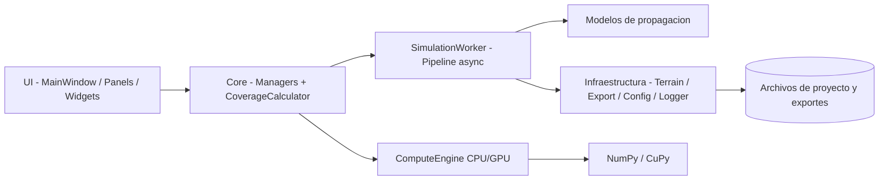
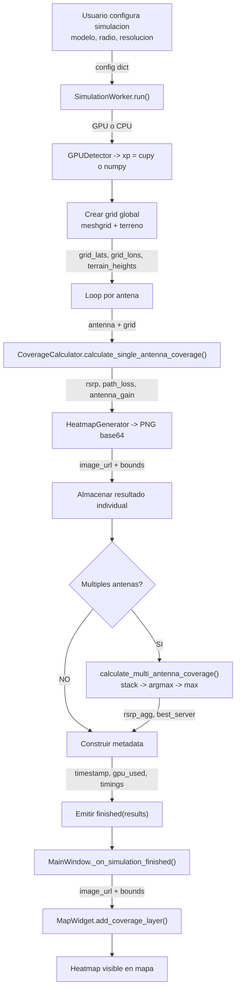
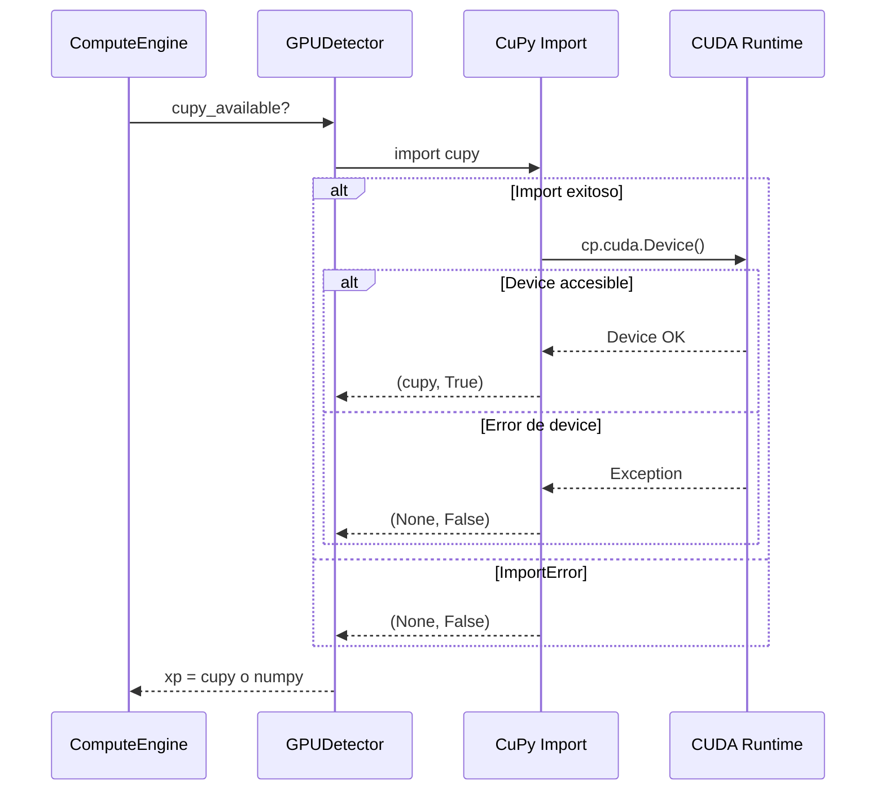
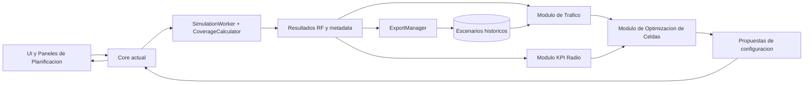

# Manual Tecnico — RF Coverage Tool

**Version:** 1.0  
**Fecha:** 2026-05-10  
**Aplicacion:** RF Coverage Tool v1.0  
**Audiencia:** Ingenieros de desarrollo, investigadores y revisores tecnicos.

---

## Tabla de Contenidos

1. [Introduccion y alcance](#1-introduccion-y-alcance)
2. [Arquitectura del sistema](#2-arquitectura-del-sistema)
3. [Stack tecnologico](#3-stack-tecnologico)
4. [Inventario de modulos](#4-inventario-de-modulos)
5. [Pipeline de simulacion completo](#5-pipeline-de-simulacion-completo)
6. [Nucleo de computo CPU/GPU](#6-nucleo-de-computo-cpugpu)
7. [Modelos de propagacion](#7-modelos-de-propagacion)
8. [Subsistema de terreno](#8-subsistema-de-terreno)
9. [Modelo de ejecucion y threading](#9-modelo-de-ejecucion-y-threading)
10. [Sistema de medicion de rendimiento](#10-sistema-de-medicion-de-rendimiento)
11. [Sistema de exportacion](#11-sistema-de-exportacion)
12. [Sistema de logging](#12-sistema-de-logging)
13. [Escalabilidad y planificacion radio](#13-escalabilidad-y-planificacion-radio)
14. [Glosario tecnico](#14-glosario-tecnico)
15. [Referencias](#15-referencias)

---

## 1. Introduccion y alcance

Este manual describe la arquitectura interna, los modulos, los flujos de datos y las decisiones de implementacion del sistema RF Coverage Tool. Sirve como referencia tecnica para:

- Comprender como esta estructurado el sistema.
- Extender o modificar modulos existentes.
- Reproducir resultados de simulacion.
- Evaluar el rendimiento comparativo CPU vs GPU.
- Integrar nuevas funcionalidades de planificacion radio.

El documento consolida y sintetiza toda la documentacion tecnica disponible en `docs/`.

---

## 2. Arquitectura del sistema

### 2.1 Tipo de arquitectura

La aplicacion implementa una **arquitectura modular en capas**, combinada con tres patrones complementarios:

- **Coordinacion por managers**: el estado de entidades (antenas, proyectos, sitios) se centraliza en managers con API definida y senales Qt.
- **Pipeline de simulacion en worker asincrono**: el calculo pesado corre en un hilo separado sin bloquear la UI.
- **Estrategia de modelos de propagacion**: los modelos RF son clases intercambiables que comparten la misma interfaz.

### 2.2 Capas del sistema

| Capa | Rol | Modulos principales |
|------|-----|---------------------|
| Presentacion (UI) | Interaccion con usuario, visualizacion | `MainWindow`, `MapWidget`, paneles, dialogos |
| Aplicacion (core + workers) | Coordinacion, flujo de simulacion | Managers, `CoverageCalculator`, `SimulationWorker` |
| Dominio (models) | Entidades de negocio y estado | `Antenna`, `Project`, `Site` |
| Infraestructura (utils + data) | Persistencia, exportacion, hardware, logging | `ExportManager`, `ConfigManager`, `GPUDetector`, `TerrainLoader` |

### 2.3 Diagrama de alto nivel



### 2.4 Principios de diseno aplicados

- **Bajo acoplamiento entre capas**: la UI no implementa logica de negocio; el core no depende de detalles visuales.
- **Alta cohesion por modulo**: cada clase tiene una responsabilidad clara y bien delimitada.
- **Senal/ranura Qt (signal/slot)**: comunicacion entre componentes sin dependencias directas.
- **Backend de computo intercambiable**: `xp` actua como alias del modulo numerico (NumPy o CuPy), permitiendo cambiar de CPU a GPU sin alterar la logica.

---

## 3. Stack tecnologico

| Componente | Tecnologia | Version | Uso |
|-----------|-----------|---------|-----|
| Lenguaje | Python | >= 3.9 | Base del sistema |
| Framework UI | PyQt6 | 6.x | Ventanas, senales, threading |
| Mapa | Leaflet.js + QWebEngineView | — | Visualizacion cartografica |
| Computo CPU | NumPy | >= 1.20 | Calculo RF vectorizado |
| Computo GPU | CuPy | >= 11.0 | Aceleracion CUDA (opcional) |
| Terreno | rasterio + pyproj | 1.3+ / 3.4+ | Lectura GeoTIFF, transformaciones de coordenadas |
| Heatmap | matplotlib | — | Generacion de imagenes de cobertura |
| Exportes SIG | rasterio | 1.3+ | Escritura GeoTIFF multibanda |
| Logging | Python stdlib `logging` | — | Trazabilidad operacional |

---

## 4. Inventario de modulos

| Modulo | Archivo | Capa | Responsabilidad |
|--------|---------|------|-----------------|
| `main` | `src/main.py` | Entrada | Bootstrap: Qt, logging, config, ventana principal |
| Punto de entrada | `run.py` | Entrada | Prepara `sys.path` y delega a `main` |
| `MainWindow` | `src/ui/main_window.py` | UI | Composicion principal, menus, toolbars, eventos |
| `MapWidget` | `src/ui/widgets/map_widget.py` | UI | Mapa Leaflet, puente Python/JavaScript |
| `ProjectPanel` | `src/ui/panels/project_panel.py` | UI | Panel de proyecto con lista de antenas |
| `SimulationDialog` | `src/ui/dialogs/` | UI | Dialogo de configuracion de simulacion |
| `ProjectManager` | `src/core/project_manager.py` | Core | Ciclo de vida de proyectos, persistencia, backup |
| `AntennaManager` | `src/core/antenna_manager.py` | Core | Estado y eventos de antenas |
| `SiteManager` | `src/core/site_manager.py` | Core | Gestion de sitios |
| `CoverageCalculator` | `src/core/coverage_calculator.py` | Core | Calculo de cobertura individual y multiantena |
| `ComputeEngine` | `src/core/compute_engine.py` | Core | Seleccion y conmutacion CPU/GPU, expone `xp` |
| `TerrainLoader` | `src/core/terrain_loader.py` | Core | Carga de DEM, transformacion de coordenadas, consulta de elevaciones |
| `SimulationWorker` | `src/workers/simulation_worker.py` | Workers | Pipeline de simulacion asincrono |
| `Antenna` | `src/models/antenna.py` | Dominio | Entidad antena con propiedades RF |
| `Project` | `src/models/project.py` | Dominio | Entidad proyecto |
| `Site` | `src/models/site.py` | Dominio | Entidad sitio |
| `ConfigManager` | `src/utils/config_manager.py` | Infra | Configuracion con defaults y merge profundo |
| `ExportManager` | `src/utils/export_manager.py` | Infra | Exportes CSV / KML / GeoTIFF / JSON |
| `GPUDetector` | `src/utils/gpu_detector.py` | Infra | Deteccion de GPU y fallback a CPU |
| `HeatmapGenerator` | `src/utils/heatmap_generator.py` | Infra | Conversion de arrays a imagen PNG base64 |
| `setup_logger` | `src/utils/logger.py` | Infra | Inicializacion del sistema de logging |
| Modelos RF | `src/core/models/traditional/` y `gpp_3gpp/` | Dominio | Implementaciones de modelos de propagacion |

---

## 5. Pipeline de simulacion completo

### 5.1 Diagrama de flujo



### 5.2 Estructura de datos de entrada (config)

```python
config = {
    'model': 'cost231',          # str: modelo de propagacion seleccionado
    'radius_km': 5.0,            # float: radio del area en km
    'resolution': 500,           # int: puntos por lado (500x500 = 250.000 puntos)
    'environment': 'Urban',      # str: tipo de entorno
    'building_height': 15.0,     # float: altura edificios (COST-231)
    'street_width': 12.0,        # float: ancho de calle (COST-231)
    'frequency_override_mhz': 0, # float: 0 = usar frecuencia de la antena
}
```

### 5.3 Estructura de datos de salida (results)

```python
results = {
    'individual': {
        'antenna-id-1': {
            'lats': ndarray,       # (N, N) latitudes del grid
            'lons': ndarray,       # (N, N) longitudes del grid
            'rsrp': ndarray,       # (N, N) potencia recibida en dBm
            'path_loss': ndarray,  # (N, N) perdida de trayecto en dB
            'antenna_gain': ndarray,
            'image_url': str,      # PNG en base64 para Leaflet
            'bounds': [[lat_min, lon_min], [lat_max, lon_max]]
        },
        # ... una entrada por antena
    },
    'aggregated': { ... },  # misma estructura, resultado combinado
    'metadata': {
        'timestamp': str,
        'gpu_used': bool,
        'total_execution_time_seconds': float,
        'antenna_coverage_times_seconds': dict,
        'antenna_render_times_seconds': dict,
        'multi_antenna_aggregation_time_seconds': float,
        # ...
    }
}
```

### 5.4 Etapas del pipeline con timings

| Etapa | Timer | Descripcion |
|-------|-------|-------------|
| Terreno + grid | `terrain_time` | Carga DEM e interpolacion de elevaciones en el grid global |
| Calculo RF por antena | `coverage_calc_time` | Haversine + modelo de propagacion + ganancia de antena |
| Render por antena | `render_time` | Conversion del array de RSRP a imagen PNG (matplotlib) |
| Agregacion multiantena | `aggregation_time` | Stack de arrays, argmax pixel a pixel, best_server |
| Total | `total_time` | Suma de todas las etapas desde inicio hasta emision de resultados |

---

## 6. Nucleo de computo CPU/GPU

### 6.1 ComputeEngine y backend `xp`

`ComputeEngine` selecciona el modulo numerico activo y lo expone como `xp`:

```python
# CPU mode: xp = numpy
# GPU mode: xp = cupy
self.xp = cupy  # o numpy segun disponibilidad
```

Todos los calculos numericos en `CoverageCalculator` usan `self.xp.*` en lugar de `np.*`. Esto permite que el mismo codigo funcione en ambos backends sin ramificaciones.

**Conmutacion en runtime:**  
`ComputeEngine.switch_compute_mode(use_gpu: bool)` permite cambiar entre CPU y GPU durante la sesion. Emite la senal `gpu_mode_changed` para que la UI actualice el indicador.

### 6.2 Deteccion de GPU (GPUDetector)

El proceso de deteccion es seguro y silencioso:



Si CuPy no esta disponible o la GPU no es accesible, el sistema cae automaticamente a NumPy sin interrumpir la ejecucion.

### 6.3 Construccion de grid (meshgrid)

El grid de simulacion se construye una sola vez por simulacion y se reutiliza para todas las antenas:

- Entrada: limites geograficos del area, resolucion N.
- Proceso: `np.linspace` en lat y lon -> `np.meshgrid` -> grilla 2D de (N x N) puntos.
- Salida: `grid_lats` (N, N), `grid_lons` (N, N), `terrain_heights` (N, N).

Para 500 de resolucion: 250.000 puntos evaluados por modelo por antena.

### 6.4 Calculo de distancias (formula Haversine)

La distancia geodesica entre la antena y cada punto del grid se calcula vectorialmente:

$$d = 2R \arctan2\!\left(\sqrt{a},\,\sqrt{1-a}\right)$$

donde:

$$a = \sin^2\!\left(\frac{\Delta\phi}{2}\right) + \cos\phi_1\cos\phi_2\sin^2\!\left(\frac{\Delta\lambda}{2}\right)$$

$R = 6\,371\,000$ m (radio terrestre), $\phi$ = latitud en radianes, $\lambda$ = longitud en radianes.

La implementacion usa `self.xp.sin`, `self.xp.cos`, `self.xp.arctan2` para que opere en GPU o CPU segun el backend activo.

### 6.5 Agregacion multiantena

Para despliegues de mas de una antena, la agregacion determina el mejor servidor en cada pixel:

```
rsrp_stack = xp.stack([rsrp_antena_1, rsrp_antena_2, ...])  # (N_ant, H, W)
best_indices = xp.argmax(rsrp_stack, axis=0)                  # (H, W)
rsrp_agregado = xp.max(rsrp_stack, axis=0)                    # (H, W)
```

`best_server` (mapa de cual antena gana en cada pixel) se construye en NumPy porque `dtype=object` no esta soportado en GPU.

---

## 7. Modelos de propagacion

### 7.1 Tabla comparativa

| Modelo | Clase | Tipo | Frec. (MHz) | Dist. | Entorno | LOS/NLOS |
|--------|-------|------|-------------|-------|---------|----------|
| Free Space | `FreeSpacePathLossModel` | Determinístico | Sin limite | Sin limite | Solo LOS | Solo LOS |
| Okumura-Hata | `OkumuraHataModel` | Empírico | 150 – 2000 | 1 – 20 km | Urb/Sub/Rur | Promediado |
| COST-231 W-I | `COST231WalfischIkegamiModel` | Semi-determ. | 800 – 2000 | 20 m – 5 km | Urbano | Heurístico |
| ITU-R P.1546 | `ITUR_P1546Model` | Empírico pto-area | 30 – 4000 | 1 – 1000 km | Urb/Sub/Rur | TCA continuo (no binario) |
| 3GPP TR 38.901 | `ThreGPP38901Model` | Probabilístico | 500 – 100000 | 10 m – 10 km | UMa/UMi/RMa | P_LOS(d) |

### 7.2 Ecuaciones clave por modelo

#### Free Space Path Loss

$$\text{FSPL}_{\text{dB}} = 20\log_{10}(d_{\text{km}}) + 20\log_{10}(f_{\text{MHz}}) + 32.45$$

La constante 32.45 se deriva de la ecuacion de Friis con $d$ en km y $f$ en MHz.

#### Okumura-Hata (Urban)

$$L_u = 69.55 + 26.16\log(f) - 13.82\log(h_b) - a(h_m) + \bigl[44.9 - 6.55\log(h_b)\bigr]\log(d)$$

donde $a(h_m)$ es el factor de correccion de altura de antena movil:
- Ciudad grande (f >= 300 MHz): $a(h_m) = 3.2[\log(11.75 h_m)]^2 - 4.97$
- Ciudad mediana: $a(h_m) = (1.1\log f - 0.7)h_m - (1.56\log f - 0.8)$

#### COST-231 Walfisch-Ikegami

$$L_{total} = L_0 + L_{rtd} + L_{msd} + C_f$$

- $L_0$: perdida en espacio libre.
- $L_{rtd}$: difraccion sobre ultima fila de edificios (Ikegami).
- $L_{msd}$: difraccion multi-pantalla (Walfisch).
- $C_f$: factor de entorno (0 dB urbano, 3 dB suburban).

#### ITU-R P.1546

$$L = L_0 + \Delta_h + \Delta_f + \Delta_{\text{env}}$$

Donde $L_0$ es la perdida base de la curva estandar interpolada en frecuencia, distancia y altura efectiva TX. El calculo sigue un **pipeline de 5 pasos**:

1. `h_eff = h_tx + z_tx - z_mean(3-15km)` — altura efectiva vectorizada (§4.3)
2. `E = interpolar_3D(f, d, h_eff)` — intensidad de campo desde tablas 100/600/2000 MHz
3. `TCA = max(arctan(z_rel/d))` — terrain clearance angle (§4.5, continuo, no binario)
4. `ΔE = TCA_corr + clutter(P.2108-1)` — correcciones de ambiente
5. `PL = 139.3 + 20·log(f) - E + ΔE` — conversion de campo a perdida

> **Nota:** Existe `_calculate_radio_horizon(h_tx, h_rx) = 4.12*(sqrt(h_tx)+sqrt(h_rx))` km
> como metodo informativo, pero **no se usa** en el calculo de path loss. El modelo
> no implementa distincion LOS/NLOS binaria (`has_los_nlos = False`).

#### 3GPP TR 38.901 (UMa)

$$PL = P_{LOS}(d) \cdot PL_{LOS} + \bigl[1 - P_{LOS}(d)\bigr] \cdot PL_{NLOS}$$

Probabilidad LOS para Urban Macro:

$$P_{LOS}(d) = \min\!\left(\frac{18}{d}, 1\right)\!\left(1 - e^{-d/63}\right) + e^{-d/63}$$

### 7.3 Guia de seleccion por escenario

```
Frecuencia de operacion:
├─ < 150 MHz       → ITU-R P.1546
├─ 150 – 800 MHz   → Okumura-Hata
├─ 800 – 2000 MHz  → Okumura-Hata (> 1 km)
│                    COST-231 (urban canyon, < 5 km)
├─ 2000 – 4000 MHz → ITU-R P.1546 o 3GPP UMa/UMi
└─ > 4000 MHz      → 3GPP TR 38.901
```

### 7.4 Interfaz comun de modelos

Todos los modelos implementan el metodo:

```python
def calculate_path_loss(
    self,
    distances,       # ndarray (metros)
    frequency,       # float (MHz)
    tx_height,       # float (m AGL)
    terrain_heights, # ndarray (msnm)
    **kwargs
) -> ndarray          # path loss en dB, mismo shape que distances
```

Esta interfaz permite agregar nuevos modelos sin modificar el pipeline de simulacion.

---

## 8. Subsistema de terreno

### 8.1 Proposito

`TerrainLoader` carga un archivo GeoTIFF de elevacion y proporciona consultas de altitud en coordenadas WGS84 (lat/lon). La consulta vectorizada se usa para interpolar elevaciones en todos los puntos del grid de simulacion.

### 8.2 Stack de dependencias

- **rasterio**: lectura de GeoTIFF, acceso al sistema de referencia de coordenadas (CRS) y transformacion entre coordenadas geograficas y pixeles del raster.
- **pyproj**: transformacion de coordenadas WGS84 (EPSG:4326) al CRS del archivo de terreno.

### 8.3 Flujo de carga y consulta

```
GeoTIFF
    → rasterio.open()
    → Lee banda 1 (elevaciones) como array NumPy (H, W)
    → pyproj.Transformer WGS84 → CRS del archivo
    → Guarda bounds y transform del dataset

Consulta vectorizada (get_elevations_fast):
    → Aplanar grid_lats, grid_lons
    → Transformer: (lon, lat) → (x, y) en CRS local
    → rasterio rowcol: (x, y) → (row, col) en el raster
    → Extraer elevacion[row, col] para cada punto
    → Filtrar NoData y valores fuera de rango (0 – 10.000 m)
    → Reshape al shape original del grid
```

### 8.4 Altura efectiva del transmisor

La altura efectiva del transmisor sobre el terreno en su ubicacion se calcula como:

$$h_{\text{eff}} = h_{\text{AGL}} + (e_{\text{TX}} - e_{\text{punto}})$$

donde $e_{\text{TX}}$ es la elevacion del terreno en la posicion de la antena y $e_{\text{punto}}$ es la elevacion en cada punto del grid.

---

## 9. Modelo de ejecucion y threading

### 9.1 Motivacion

La simulacion puede tardar desde decimas de segundo hasta varios segundos segun la resolucion y el numero de antenas. Ejecutarla en el hilo principal de Qt bloquearia la interfaz. Se usa el patron **Worker + QThread**:

- El hilo principal (GUI thread) gestiona eventos de usuario.
- `SimulationWorker` corre en un QThread separado y comunica resultados via senales Qt.

### 9.2 Diagrama de comunicacion

```
GUI Thread (MainWindow)           Worker Thread (SimulationWorker)
─────────────────────────         ──────────────────────────────────
run_simulation()
  → worker.moveToThread(thread)
  → thread.start()
                                  worker.run()
                                    → progreso 10%
  ← worker.progress(10)
  → progressBar.setValue(10)
                                    → calculo antena 1
                                    → progreso 60%
  ← worker.progress(60)
  → progressBar.setValue(60)
                                    → emitir finished(results)
  ← worker.finished(results)
  → _on_simulation_finished()
  → MapWidget.add_coverage_layer()
```

### 9.3 Senales del worker

| Senal | Tipo | Descripcion |
|-------|------|-------------|
| `progress` | `pyqtSignal(int)` | Porcentaje de avance (0-100) |
| `status_message` | `pyqtSignal(str)` | Mensaje de estado para barra inferior |
| `finished` | `pyqtSignal(dict)` | Resultados completos de la simulacion |
| `error` | `pyqtSignal(str)` | Mensaje de error si la simulacion falla |

### 9.4 Cancelacion

`worker.stop()` establece `should_stop = True`. El loop por antena verifica esta bandera al inicio de cada iteracion y retorna sin emitir `finished`.

---

## 10. Sistema de medicion de rendimiento

### 10.1 Mecanismo

Se usa `time.perf_counter()` (resolucion sub-microsegundo en Windows/Linux) para medir cada etapa del pipeline. Los tiempos se registran dentro de `SimulationWorker.run()` y se incluyen en el dict `results['metadata']`.

### 10.2 Timers implementados

| Timer | Variable | Que mide |
|-------|----------|----------|
| Inicio total | `sim_start` | Referencia para `total_time` |
| Carga de terreno | `terrain_time` | Tiempo de carga DEM + interpolacion de elevaciones |
| Inicio por antena | `antenna_start` | Referencia para `antenna_time` |
| Calculo RF | `coverage_calc_time` | Haversine + modelo + ganancia (sin render) |
| Render | `render_time` | Generacion de imagen PNG con matplotlib |
| Agregacion | `aggregation_time` | Stack + argmax + max + best_server |
| Total | `total_time` | Tiempo completo de `run()` |

### 10.3 Schema del JSON de metadata exportado

```json
{
  "compute_performance": {
    "gpu_used": true,
    "gpu_device": "GPU: NVIDIA GeForce GTX 1660 SUPER (CC 7.5)",
    "total_execution_time_seconds": 1.64,
    "terrain_loading_time_seconds": 0.247,
    "antenna_total_times_seconds": { "ant-id": 0.686 },
    "antenna_coverage_times_seconds": { "ant-id": 0.402 },
    "antenna_render_times_seconds": { "ant-id": 0.276 },
    "multi_antenna_aggregation_time_seconds": 0.358
  }
}
```

### 10.4 Interpretacion CPU vs GPU

- `antenna_coverage_times_seconds`: tiempo puro de calculo RF. Es el indicador correcto para comparar CPU vs GPU.
- `antenna_render_times_seconds`: tiempo de render de imagen (matplotlib, siempre en CPU). No se ve afectado por GPU.
- La primera ejecucion GPU puede mostrar un valor elevado por inicializacion de contexto CUDA (warm-up). Las ejecuciones subsiguientes muestran el rendimiento estable.
- Para comparativas rigurosas: descartar primera corrida, promediar mediana de 5+ corridas por modo.

---

## 11. Sistema de exportacion

### 11.1 Formatos disponibles

| Formato | Extension | Contenido | Uso tipico |
|---------|-----------|-----------|------------|
| CSV | `.csv` | Tabla de puntos: lat, lon, RSRP, path loss, ganancia | Excel, Python, analisis estadistico |
| Metadata JSON | `_metadata.json` | Parametros, tiempos, configuracion | Reproducibilidad, auditoria |
| KML | `.kml` | Heatmap georreferenciado como GroundOverlay | Google Earth |
| GeoTIFF | `.tif` | Raster 3 bandas (RSRP, path loss, ganancia) | QGIS, ArcGIS |

### 11.2 Flujo del ExportManager

```
results dict (de SimulationWorker)
    │
    ├─ export_csv()
    │     → Iterar puntos de coverage['individual']
    │     → Escribir fila por punto con valores de cada antena
    │
    ├─ export_metadata_json()
    │     → Extraer results['metadata']
    │     → Serializar con schema estandar
    │
    ├─ export_kml()
    │     → Usar coverage['aggregated'] si existe
    │     → Extraer image_url (PNG base64)
    │     → Decodificar PNG y guardar como archivo separado
    │     → Escribir KML con GroundOverlay
    │
    └─ export_geotiff()
          → Usar coverage['aggregated'] si existe
          → Crear transform Affine desde bounds del grid
          → Escribir 3 bandas: RSRP, path_loss, antenna_gain
          → CRS: EPSG:4326 (WGS84)
```

### 11.3 Ubicacion de archivos exportados

Por defecto: `data/exports/`. Nombre base: `simulacion_YYYYMMDD_HHMMSS`.

---

## 12. Sistema de logging

### 12.1 Inicializacion

`setup_logger()` se invoca una sola vez al arranque en `src/main.py`, antes de instanciar cualquier componente. Configura:

- **Handler de archivo**: `logs/app_YYYYMMDD.log`, rotativo (max 10 MB, 5 backups).
- **Handler de consola**: salida a stdout.
- **Formato**: `YYYY-MM-DD HH:MM:SS - NombreClase - NIVEL - mensaje`.

### 12.2 Alcance del logging

18 clases del sistema registran eventos. Los niveles usados:

| Nivel | Uso tipico |
|-------|-----------|
| `INFO` | Eventos normales de operacion (inicio, fin, guardado) |
| `DEBUG` | Detalles de calculo, valores intermedios |
| `WARNING` | Situaciones recuperables (terreno no cargado, config faltante) |
| `ERROR` | Errores con traceback (excepcion en simulacion, fallo de exportacion) |

### 12.3 Configuracion del nivel

En `config/settings.json`:
```json
{
  "logging": {
    "level": "INFO",
    "max_file_size_mb": 10,
    "backup_count": 5
  }
}
```

---

## 13. Escalabilidad y planificacion radio

### 13.1 Extensiones inmediatas disponibles

La arquitectura modular admite crecer en estas dimensiones sin reescribir el nucleo:

| Extension | Como se integra |
|-----------|----------------|
| Nuevo modelo de propagacion | Nueva clase con metodo `calculate_path_loss()`, registrar en selector de `SimulationWorker` |
| Nuevo formato de exportacion | Nuevo metodo en `ExportManager`, agregar opcion en menu |
| Nuevo panel de analisis | Nuevo widget en `src/ui/`, conectar a datos de `results` |
| Nuevo worker especializado | Nuevo archivo en `src/workers/`, usar `AntennaManager` y `CoverageCalculator` existentes |
| Optimizacion de rendimiento | Evolucionar `CoverageCalculator` o `ComputeEngine` conservando la misma API |

### 13.2 Modulos de planificacion radio sobre la base actual

La arquitectura permite agregar capacidades de planificacion sin romper el nucleo RF:

- **Modulo de trafico**: estimacion de demanda espacial, hora pico, capacidad por sector. Toma como entrada los resultados de cobertura.
- **Modulo de optimizacion de celdas**: ajuste de potencia, azimuth, tilt. Lee RSRP por antena y propone configuraciones.
- **Modulo de expansion de red**: identifica zonas sin cobertura y recomienda nuevos sitios.
- **Modulo de KPI radio**: metricas de cobertura, capacidad, interferencia y calidad por escenario.

### 13.3 Diagrama de expansion



Los nuevos modulos se conectan por contratos de datos (los `results dict`), reutilizan el motor RF y agregan inteligencia de planificacion sobre la misma plataforma sin necesidad de rehacer el calculo de cobertura.

---

## 14. Glosario tecnico

| Termino | Definicion |
|---------|------------|
| **AGL** | Above Ground Level — altura medida desde el nivel del suelo local del transmisor. |
| **a(h_m)** | Factor de correccion de altura de antena movil en Okumura-Hata. |
| **CCIR** | Comite Consultivo Internacional de Radiocomunicaciones (antecesor de la UIT-R). |
| **CRS** | Coordinate Reference System — sistema de referencia espacial del raster de terreno. |
| **CuPy** | Libreria Python compatible con NumPy para ejecucion en GPU NVIDIA via CUDA. |
| **DEM** | Digital Elevation Model — modelo digital de elevacion del terreno (GeoTIFF). |
| **EPSG:4326** | Sistema de coordenadas WGS84, estandar GPS. |
| **ExportManager** | Modulo que serializa resultados a CSV, KML, GeoTIFF y JSON. |
| **FSPL** | Free Space Path Loss — perdida de propagacion en espacio libre sin obstrucciones. |
| **GeoTIFF** | Formato de imagen raster con metadatos de georeferencia integrados. |
| **GPU** | Graphics Processing Unit — usada para computo paralelo masivo via CUDA. |
| **Haversine** | Formula para calcular distancia geodesica entre dos puntos en una esfera. |
| **HeatmapGenerator** | Modulo que convierte arrays NumPy de RSRP a imagen PNG en base64. |
| **ITU-R P.1546** | Recomendacion de la UIT para prediccion de cobertura punto-area en VHF/UHF. |
| **KML** | Keyhole Markup Language — formato geoespacial compatible con Google Earth. |
| **LOS** | Line of Sight — linea de vision directa entre transmisor y receptor sin obstruccion. |
| **NLOS** | Non Line of Sight — condicion con obstruccion en la trayectoria de la senal. |
| **NumPy** | Libreria base de computo numerico vectorizado en Python (CPU). |
| **Path loss** | Perdida de trayecto — atenuacion total de la senal entre TX y RX en dB. |
| **P_LOS(d)** | Probabilidad de condicion LOS en funcion de la distancia (modelo 3GPP). |
| **PyQt6** | Framework de interfaz grafica para Python basado en Qt 6. |
| **QThread** | Clase de Qt para ejecucion de tareas en hilos separados. |
| **Raster** | Representacion matricial de datos geograficos sobre una grilla regular. |
| **RF** | Radio Frequency — rango de frecuencias del espectro electromagnetico usado en comunicaciones. |
| **rasterio** | Libreria Python para lectura y escritura de datos raster geoespaciales. |
| **RSRP** | Reference Signal Received Power — potencia de senal recibida en dBm; indicador principal de cobertura. |
| **SimulationWorker** | Worker que ejecuta el pipeline de simulacion en hilo separado sin bloquear la GUI. |
| **TerrainLoader** | Modulo que carga DEM GeoTIFF y provee consultas de elevacion. |
| **TR 38.901** | Especificacion 3GPP para modelado de canal en redes 5G NR (0.5-100 GHz). |
| **UMa / UMi / RMa** | Urban Macro / Urban Micro / Rural Macro — escenarios del modelo 3GPP TR 38.901. |
| **WGS84** | World Geodetic System 1984 — sistema de referencia de coordenadas geograficas (GPS). |
| **xp** | Alias del backend de computo activo: `numpy` (CPU) o `cupy` (GPU). |

---

## 15. Referencias

### Normas y modelos de propagacion
- **ITU-R P.1546-6** (agosto 2019): Method for point-to-area predictions for terrestrial services.
- **3GPP TR 38.901 v17.0.0** (2022): Study on channel model for frequencies from 0.5 to 100 GHz.
- **Okumura, Y.** (1968): Field strength and its variability in VHF and UHF land-mobile service. Rev. Elect. Commun. Lab., 16(9-10).
- **Hata, M.** (1980): Empirical formula for propagation loss in land mobile radio services. IEEE Trans. Vehicular Technology, 29(3).
- **COST 231 Final Report** (1999): Digital Mobile Radio: COST 231 View on the Evolution Towards 3rd Generation Systems. Cap. 4: COST-231 Walfisch-Ikegami model.
- **Friis, H.T.** (1946): A note on a simple transmission formula. Proc. IRE, 34(5).

### Herramientas y librerias
- **NumPy**: Harris et al. (2020), Array programming with NumPy. Nature, 585.
- **CuPy**: Okuta et al. (2017), CuPy: A NumPy-Compatible Library for NVIDIA GPU Calculations.
- **PyQt6**: The Qt Company. Qt 6 Documentation. https://doc.qt.io/qt-6/
- **rasterio**: Mapbox. Rasterio: access to geospatial raster data. https://rasterio.readthedocs.io/
- **pyproj**: Whitaker et al. pyproj: Python interface to PROJ. https://pyproj4.github.io/pyproj/

### Documentacion interna del proyecto
- [ARQUITECTURA_APLICACION.md](ARQUITECTURA_APLICACION.md): Arquitectura modular del sistema.
- [01_GUI.md](01_GUI.md): Arquitectura de la interfaz grafica.
- [02_CORE_COMPUTE.md](02_CORE_COMPUTE.md): Nucleo de computo y vectorizacion.
- [03_MODELOS_PROPAGACION.md](03_MODELOS_PROPAGACION.md) y [03A](03A_OKUMURA_HATA.md) — [03E](03E_FREE_SPACE.md): Modelos de propagacion.
- [06_TERRENO.md](06_TERRENO.md): Subsistema de terreno DEM.
- [08_GPU_DETECTOR.md](08_GPU_DETECTOR.md): Deteccion de GPU.
- [09_PIPELINE_SIMULACION_FLUJO.md](09_PIPELINE_SIMULACION_FLUJO.md): Pipeline de simulacion.
- [10_MODELO_EJECUCION_THREADS.md](10_MODELO_EJECUCION_THREADS.md): Threading y workers.
- [11_MEDICION_TIEMPO.md](11_MEDICION_TIEMPO.md): Sistema de medicion de rendimiento.
- [05_EXPORTACION.md](05_EXPORTACION.md): Sistema de exportacion.
- [05_LOGGING.md](05_LOGGING.md): Sistema de logging.
- [07_GLOSARIO.md](07_GLOSARIO.md): Glosario tecnico base.

---

*Manual generado el 2026-05-10. Para uso en la aplicacion referirse al Manual de Usuario (MANUAL_USUARIO.md).*
